# Northwind Traders TUI

A terminal-based warehouse/distribution management application built on the classic
**Northwind** sample database. Stack: **Python + Textual + SQLite**.

---

## Version History

| Version | Theme | Key additions |
|---------|-------|---------------|
| **v1.4** | Foundation | 9 CRUD panels, SQL editor, 6 reports + CSV export, PIN login, role-based UI, multi-column form modals |
| **v2.0** | Documents & Finance | Document workflow (DN/INV/GR/SI/SO), Cash Register & Bank Account, Charts, extended KPIs, 7 UX enhancements, finance dashboard KPIs |
| **v2.1** | PDF Export | Branded A4 PDF delivery notes (DN) & invoices (INV) — company logo, theme colours, totals, linked DN references |
| **v2.2** | PDF All Docs + UX | PDF export for GR, CR, CP & Bank entries; Business Details tabbed layout with docked Save button |
| **v2.3** | UI Polish | Business Details compact one-screen tabs; form layout optimisation across Company / Tax / Documents |
| **v2.4** | Data Integrity | 3-tier roles (user/manager/admin), delete guards, document cancellation, Credit Notes (CN), 82 automated tests |
| **v2.5** | English International | All Polish abbreviations replaced with English (WZ→DN, FV→INV, FK→CN, PZ→GR, PW→SI, RW→SO, KP→CR, KW→CP) |
| **v2.6** | UI Polish | Wider modals, stretch Select/Button widgets, compact picker layout |
| **v2.7** | CSV Import | CSV import for master data — Customers, Suppliers, Products, Categories |
| **v2.8** | File Selector & Export Cleanup | File browser modal for all exports/imports, centralized CSV export logic |
| **v2.9** | CSV Round-Trip Fix | CSV import now accepts export display headers (ID, Company, Contact…) via alias mappings |
| **v2.10** | Import/Export Fixes | Fix Ctrl+X/Ctrl+I keybindings globally; fix Products & Orders CSV import column mappings |
| **v2.13** | AR/AP All Unpaid View | Reconciliation panel default "All Unpaid" view across all customers/suppliers; optional entity filter; sub-view toggle (All Unpaid / Statement) |
| **v2.14** | QR Codes on PDFs | QR code embedded in every PDF document header; toggle in Business Details → Documents; encodes doc type, number, date, counterparty, amount |
| **v2.15** | Help System | Searchable help panel with FAQ category; context-sensitive `?` shortcut jumps to the relevant topic for the active panel |
| **v2.16** | Demo Data UX | Test/Production mode switch in Settings; PIN-protected `TestModeWarningModal`; "Clean Database" modal clarifies what is preserved |

---

## Features (v2.16)

### New in v2.16 — Demo Data Test/Production Switch + Clean Database

- **Test/Production mode switch** — Settings › Demo Data gains a `Switch` widget that shows the current database mode; label reads "Test Mode" or "Production"
- **Toggle Production → Test** — opens `TestModeWarningModal`: red bold warning that ~1 500 records will be added, PIN-protected, max 3 attempts; cancel reverts the switch
- **Toggle Test → Production** — opens the existing `CleanDatabaseModal` with updated body text; cancel reverts the switch
- **"Clean Database" button** (renamed from "Clean Demo Data") — same PIN modal, same behaviour; modal text now explicitly lists what is preserved: settings, business details, and user accounts
- **`.modal-warning` CSS class** — red bold label style used in both modals for destructive-action summaries
- **Async Switch.Changed fix** — `Switch.value` enqueues a message rather than firing synchronously; the handler guards against re-entrant modal launches by comparing the incoming value against the persisted DB state

---

## Features (v2.15)

### New in v2.15 — Help System Overhaul

- **Searchable Help panel** — full-text filter across all topics; sidebar table of contents with category column
- **FAQ category** — curated answers to the most common workflow questions (how to invoice, cancel a DN, record a payment, etc.)
- **All stale topics updated** — topics that referenced old Polish abbreviations (WZ, FV…) or missing features now reflect the current v2.14+ state
- **Context-sensitive `?` shortcut** — pressing `?` from any panel switches to Help and pre-filters to the topic most relevant to that panel (e.g. `?` from Invoices → "Invoices" topic); second press with no filter shows all topics

---

## Features (v2.14)

### New in v2.14 — QR Codes on All PDF Documents

- **QR code in every PDF header** — all 7 document types (DN, INV, GR, CR, CP, Bank, CN) embed a scannable 20 mm QR code flush with the top-right corner of the branded header
- **Pipe-delimited payload** — each QR encodes doc type, number, date, counterparty name and key financial fields (e.g. `INV|INV/2026/001|2026-03-03|Acme Corp|1250.00|0.00|bank transfer`)
- **Toggle in Business Details → Documents tab** — "Show QR codes on all documents" switch; on by default (fresh DB with no saved setting shows QR)
- **Safe by design** — QR generation wrapped in `try/except`; any failure is silently skipped so PDF export always succeeds
- **Supplier Spending report** — new report type (now 12 total); shows GR totals per supplier with date-range filter
- **Company logo browser** — Business Details → Company tab has a Browse button; selected image is copied to `assets/logo<ext>` inside the app folder
- **Sales report JOIN fix** — `sales_by_customer` and `sales_by_product` now use inner JOIN so customers/products with no orders in the selected period are excluded

---

## Features (v2.13)

### New in v2.13 — AR/AP All Unpaid View

- **All Unpaid default view** — Reconciliation panel opens immediately showing all outstanding invoices (AR) or unallocated goods receipts (AP) — no entity pick required
- **Sub-view toggle** — `[All Unpaid]` / `[Statement]` buttons (keyboard `U` / `S`) switch between the flat unpaid list and the per-entity running-balance ledger
- **Optional filter** — `▼ Filter` button narrows the unpaid list to one customer/supplier; `✕ Clear` resets to all entities
- **Pay Invoice from unpaid list** — select any INV row in the unpaid view and press `P` to register a payment directly
- **AR Aging bar** — visible in the All Unpaid AR view
- **4 new automated tests** — `fetch_all_unpaid_inv` and `fetch_all_unpaid_gr` (all + filtered)

---

## Features (v2.10)

### New in v2.10 — Import/Export Fixes

- **Ctrl+X / Ctrl+I keybindings** — export and import bindings now work correctly from any active panel
- **Products CSV import fix** — column aliases corrected so exported Product CSVs re-import without errors
- **Orders CSV import fix** — column aliases corrected so exported Order CSVs re-import without errors

---

## Features (v2.9)

### New in v2.9 — CSV Round-Trip Fix

CSV import now accepts the short display headers used by CSV export (e.g. `ID`, `Company`, `Contact`) in addition to the original database column names (`CustomerID`, `CompanyName`, `ContactName`). This means you can export a table with Ctrl+X, clean the database, and re-import the same CSV with Ctrl+I without errors.

- Added `_ALIASES` mapping in `data/csv_import.py` covering all 4 importable tables (Customers, Suppliers, Products, Categories)
- Aliases are merged into the header normalization map using `setdefault` so exact DB column matches always take priority
- 145 automated tests pass (including all 15 CSV import tests)

---

## Features (v2.8)

### New in v2.8 — File Selector & Export Cleanup

**File Browser Modal (`FileSelectModal`)**
- Reusable file browser with `DirectoryTree` navigation, rooted at home directory
- Two modes: **save** (CSV/PDF export — pick save location) and **open** (CSV import — pick existing file)
- Pre-filled suggested filename for exports; extension filter hides irrelevant files in the tree
- Clicking a directory updates the path; clicking a file selects it; validates before accepting

**CSV Export Centralized**
- All 10 CSV export screens now use a shared `export_csv_with_selector()` helper
- Each `action_export_csv()` reduced from ~12 lines to ~4 lines
- File selector modal opens on export — user chooses save location instead of hardcoded `~/Downloads/`

**PDF Export with Save Location**
- All 7 PDF export functions (`export_dn`, `export_inv`, `export_gr`, `export_cr`, `export_cp`, `export_bank_entry`, `export_cn`) accept optional `save_path` parameter
- `export_dn` and `export_inv` refactored to use shared `_save_pdf()` helper (eliminated inline save duplication)
- All 7 PDF screen handlers wrapped with `FileSelectModal` for user-chosen save location

**CSV Import Browse Button**
- `ImportCSVModal` gains a **Browse...** button that opens `FileSelectModal(mode="open", file_filter=".csv")`
- Selected path fills the existing file path Input; manual typing still works

---

## Features (v2.5)

### New in v2.5 — English International

All Polish accounting abbreviations replaced with English equivalents across the entire codebase:

| Old (Polish) | New (English) | Full Name |
|-------------|---------------|-----------|
| WZ | DN | Delivery Note |
| FV | INV | Invoice |
| FK | CN | Credit Note |
| PZ | GR | Goods Receipt |
| PW | SI | Stock Issue |
| RW | SO | Stock Out |
| KP | CR | Cash Receipt |
| KW | CP | Cash Payment |

Database migration is automatic — existing databases are migrated on startup.

---

## Features (v2.4)

### New in v2.4 — Data Integrity, Cancellation & Credit Notes

**3-Tier Role System**
- Hierarchical permissions: **user** (view + create) → **manager** (+ delete) → **admin** (+ cancel, CN, system)
- Delete buttons hidden from users without manager+ role
- Admin sections (SQL, Users, Business Details, Settings) remain admin-only

**Delete Guards**
- Referential integrity enforcement across all document and master data types
- Cannot delete an Order if DN exists, cannot delete INV if payments exist, etc.
- Side-effects on delete: deleting a CR/BankEntry decrements INV.PaidAmount; deleting SI/SO reverses stock
- Human-readable error messages: *"Cannot delete: DN DN/2026/003 exists for this order"*

**Document Cancellation**
- Admin-only soft cancel for DN, INV, and GR — keeps full audit trail (CancelledAt, CancelledBy, CancelReason)
- **Cancel DN** — reverses stock, blocks if invoiced (*"Cancel the INV first"*)
- **Cancel INV** — reverts linked DN to "issued", blocks if payments exist (*"Issue CN instead"*)
- **Cancel GR** — reverses stock, leaves linked payments for manual handling
- Cancellation reason modal with mandatory input; cancelled documents show reason in detail view

**Credit Notes (CN)**
- Full invoice correction system
- Three CN types: **Full Reversal**, **Partial Correction**, **Cancellation**
- Adjusts INV.TotalNet in-place; recalculates payment status (paid / partial / issued / cancelled)
- Optional stock reversal via "Return goods to stock" checkbox
- Creation wizard: pick INV → select type → edit line items (partial) → reason + date → preview → create
- Read-only detail view with original vs corrected values side-by-side
- CN PDF export with correction table, original INV reference, and prominent "CANCELLATION" banner for cancellations
- INV detail modal shows linked CN documents and "Issue CN" button
- Navigation: Documents → CN — Credit Notes

**Test Suite (82 tests)**
- `test_delete_guards.py` — guard functions, side-effects, master data referential integrity
- `test_cancellation.py` — DN/INV/GR cancellation rules, cascade behaviour, error cases
- `test_cn.py` — CN creation (all 3 types), payment/stock/pricing effects, search, numbering

---

## Features (v2.2)

### New in v2.2 — PDF for All Documents + UX Fixes

- **PDF export extended to all document types:**
  - **GR Goods Receipts** — "Receive From" supplier box, line items table with unit cost and total cost row
  - **CR Cash Receipts** — voucher with customer name, INV reference, prominent amount box, signature line
  - **CP Cash Payments** — voucher with supplier name, GR reference, prominent amount box, signature line
  - **Bank Account Entries** — direction badge (green MONEY IN / red MONEY OUT), counterparty, INV/GR references, amount box
- **Business Details panel reorganised into 3 tabs** — Company, Tax & Legal, Documents — prevents content overflow
- **Save button always visible** — docked to the bottom of the Business Details panel
- **Tab content scrollable** — long forms scroll within the tab rather than clipping off-screen

---

## Features (v2.1)

### New in v2.1 — PDF Export

- **PDF button on DN Delivery Notes** — generates a branded A4 PDF saved to `~/Downloads/`
- **PDF button on INV Invoices** — generates a branded A4 PDF saved to `~/Downloads/`
- Both documents include:
  - Company logo (if set in Business Details), name, address, contact info
  - Document title, number and date in the configured theme colour (blue / green / monochrome)
  - Ship To / Bill To address box
  - Line items table with alternating row shading and themed header row
  - VAT number and Tax ID band (when configured)
  - Configurable footer text and page N / M numbering
- **INV invoice extras**: Payment Details box (due date, terms, bank account), colour-coded Outstanding amount (red if unpaid, green if settled), linked DN reference list
- **DN price toggle**: `doc_dn_show_prices = false` in Business Details hides Unit Price and Line Total columns
- All branding (logo, colours, titles, footer) controlled via the **Business Details** panel — no code changes needed

---

## Features (v2.0)

### Core (v1.4)
- **9 CRUD panels** — Customers, Orders, Products, Employees, Suppliers, Categories,
  Shippers, Regions, Reports
- **Dashboard** with 10 live KPI cards
- **SQL Query editor** — type any SQL, press `ctrl+r`, see results in a table
- **Reports** with CSV export (11 report types)
- **Configurable currency** — symbol and name saved to SQLite ($ → £ → € etc.)
- **PIN-based login** with 3-tier role management (admin / manager / user)
- **Role-based UI** — admin sees SQL Query, Users, Settings and Business Details panels; managers can delete documents; regular users view and create only
- **Compact multi-column form modals** — related fields shown side-by-side via CSS `1fr` columns

### New in v2.0 — Documents & Finance

#### Document Workflow
- **DN — Delivery Notes** — create draft, add/remove line items, issue DN (deducts stock)
- **INV — Invoices** — generate from DN or standalone; track payment status
- **GR — Goods Receipts** — record supplier deliveries, update stock on issue
- **SI/SO — Stock Movements** — internal stock adjustments (receipts and issues)

#### Finance
- **Cash Register** — CR income entries, CP expense entries with running balance
- **Bank Account** — bank statement entries with cross-referenced Cash Register transfers

#### Analytics
- **Charts panel** — 4 tab views rendered as ANSI ASCII art via `plotext`:
  - *Sales Trend* — line chart of monthly revenue (rolling 12 months)
  - *Category Mix* — horizontal bar chart of revenue % by product category
  - *Top Employees* — bar chart of orders per employee
  - *Cash & Bank Account* — combined cash-flow view
  - Press `R` to refresh charts
- **10 KPI dashboard cards** — Orders Today, Revenue MTD, Low Stock, Pending Orders,
  Avg Fulfil Days, This Month trend arrow (↑/↓) and delta %, Cash Register Balance, Bank Account Balance,
  Open Invoices, Open DN
- **11 report types** in the Reports dropdown with date-range filter and CSV export

---

## Screenshots

> Click any thumbnail to view full size.

### Dashboard & Analytics

<table>
  <tr>
    <td align="center">
      <a href="screenshots/dashboard.png">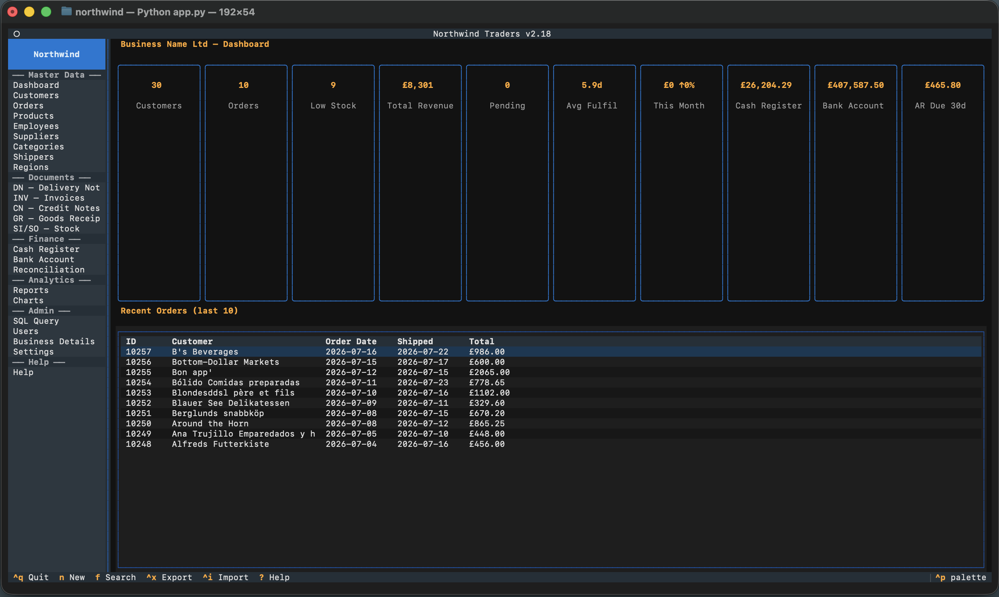</a><br/>
      <sub><b>Dashboard (10 KPI cards + recent orders)</b></sub>
    </td>
    <td align="center">
      <a href="screenshots/charts.png">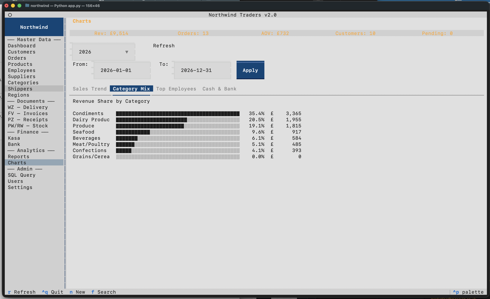</a><br/>
      <sub><b>Charts (Sales Trend sparkline + period selector)</b></sub>
    </td>
    <td align="center">
      <a href="screenshots/reports-lv.png">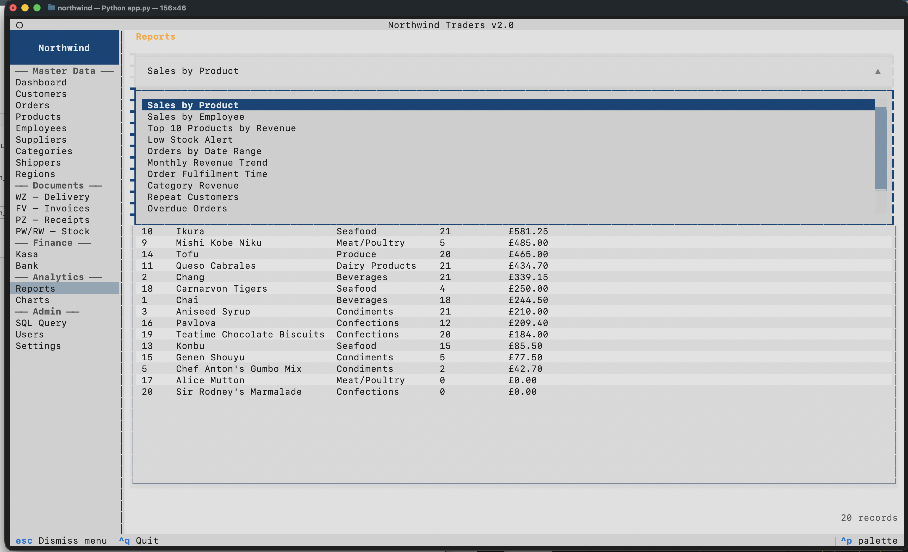</a><br/>
      <sub><b>Reports (11 report types + date range filter)</b></sub>
    </td>
  </tr>
</table>

### Master Data

<table>
  <tr>
    <td align="center">
      <a href="screenshots/customers-lv.png">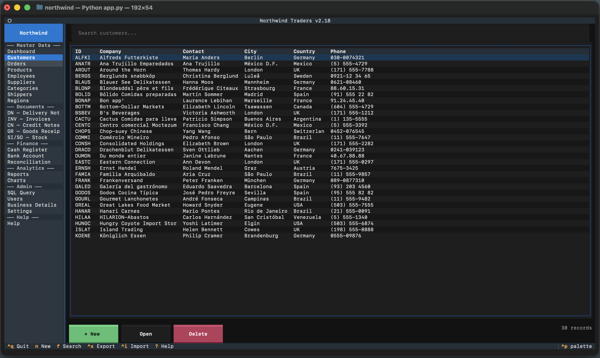</a><br/>
      <sub><b>Customers list view</b></sub>
    </td>
    <td align="center">
      <a href="screenshots/customers-dv.png">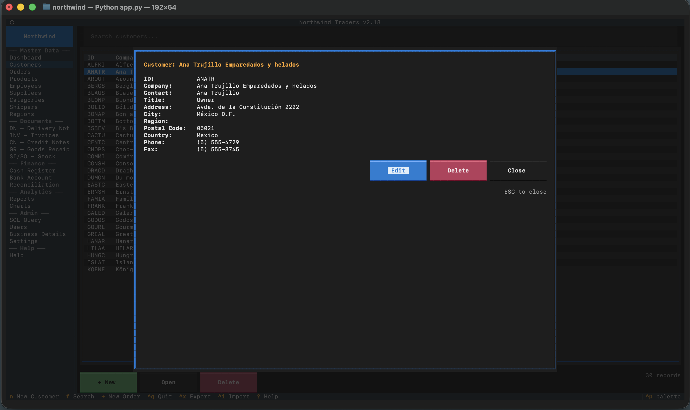</a><br/>
      <sub><b>Customer detail modal</b></sub>
    </td>
    <td align="center">
      <a href="screenshots/products-lv.png">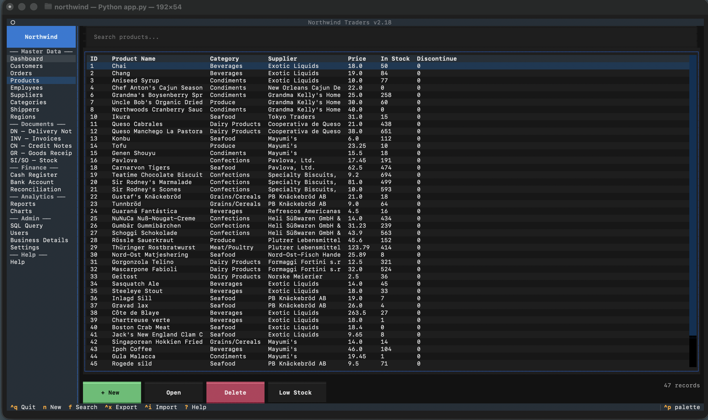</a><br/>
      <sub><b>Products list (Low Stock toggle)</b></sub>
    </td>
  </tr>
</table>

### Document Workflow

<table>
  <tr>
    <td align="center">
      <a href="screenshots/wz-dv.png">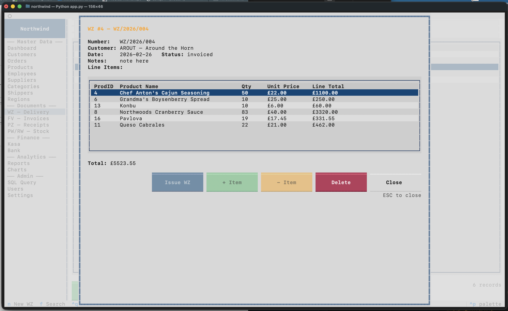</a><br/>
      <sub><b>DN Delivery Note detail</b></sub>
    </td>
    <td align="center">
      <a href="screenshots/inv-dv-from-delivery-notes.png"></a><br/>
      <sub><b>INV Invoice (generated from delivery note)</b></sub>
    </td>
    <td align="center">
      <a href="screenshots/odrers-dv.png">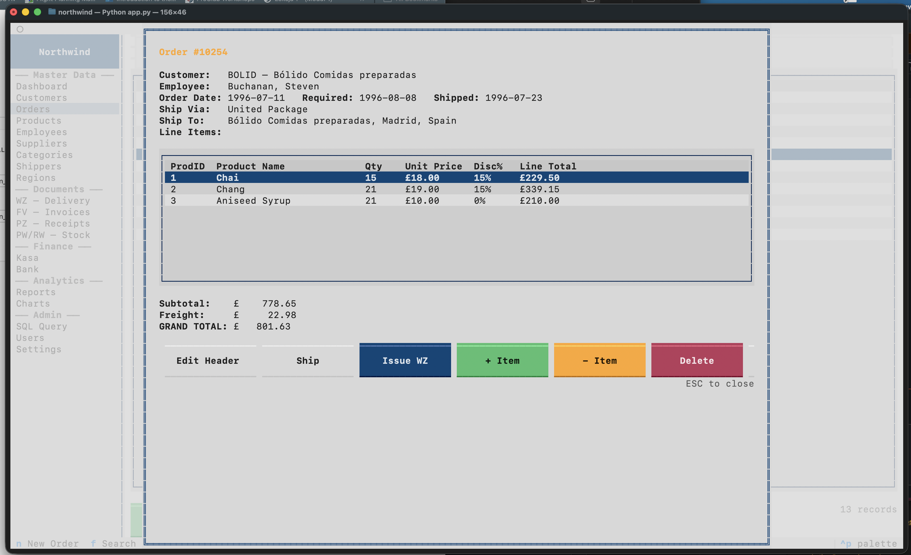</a><br/>
      <sub><b>Order detail view</b></sub>
    </td>
  </tr>
  <tr>
    <td align="center">
      <a href="screenshots/invoice_pdf.png"></a><br/>
      <sub><b>INV Invoice — exported PDF (v2.1)</b></sub>
    </td>
  </tr>
</table>

### Finance & Admin

<table>
  <tr>
    <td align="center">
      <a href="screenshots/cash-lv.png">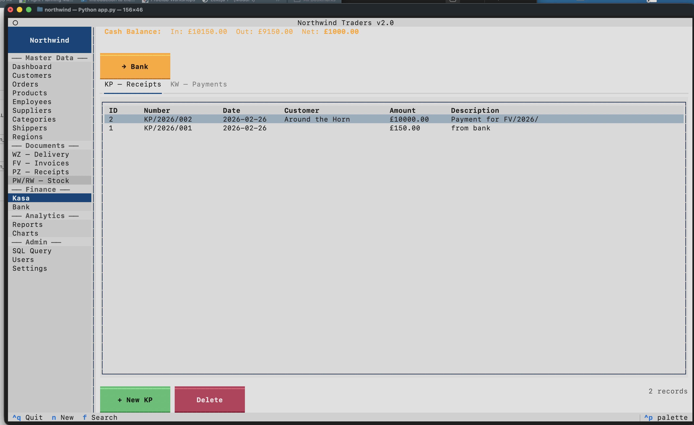</a><br/>
      <sub><b>Cash Register with CR/CP tabs</b></sub>
    </td>
    <td align="center">
      <a href="screenshots/bank-lv.png">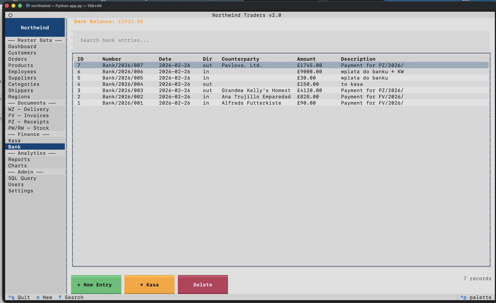</a><br/>
      <sub><b>Bank Account entries</b></sub>
    </td>
  </tr>
  <tr>
    <td align="center">
      <a href="screenshots/cash-in-receipt.png">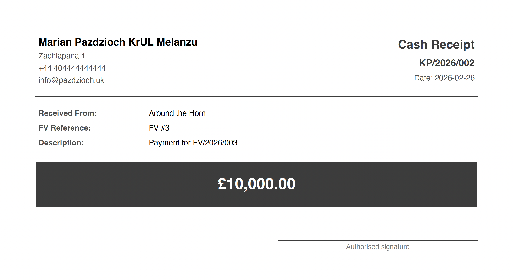</a><br/>
      <sub><b>CR Cash Receipt — exported PDF (v2.2)</b></sub>
    </td>
    <td align="center">
      <a href="screenshots/bank-transfer-pdf.png">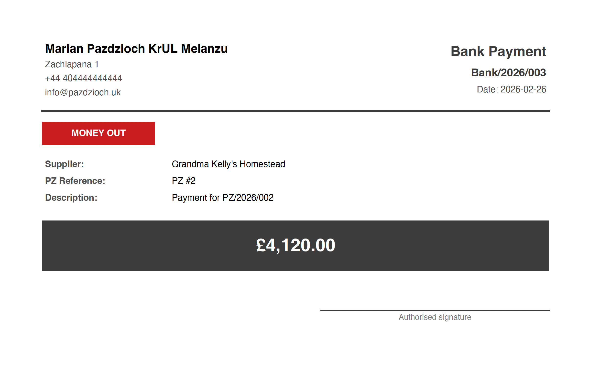</a><br/>
      <sub><b>Bank Account Entry — exported PDF (v2.2)</b></sub>
    </td>
  </tr>
  <tr>
    <td align="center">
      <a href="screenshots/sql-query.png">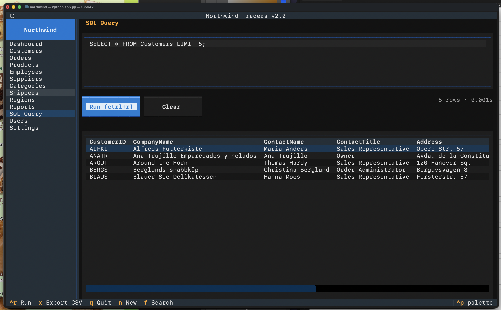</a><br/>
      <sub><b>SQL Query editor</b></sub>
    </td>
    <td align="center">
      <a href="screenshots/themes.png">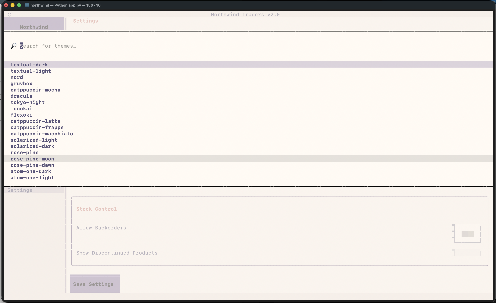</a><br/>
      <sub><b>Theme picker</b></sub>
    </td>
  </tr>
  <tr>
    <td align="center">
      <a href="screenshots/business-details-settings.png">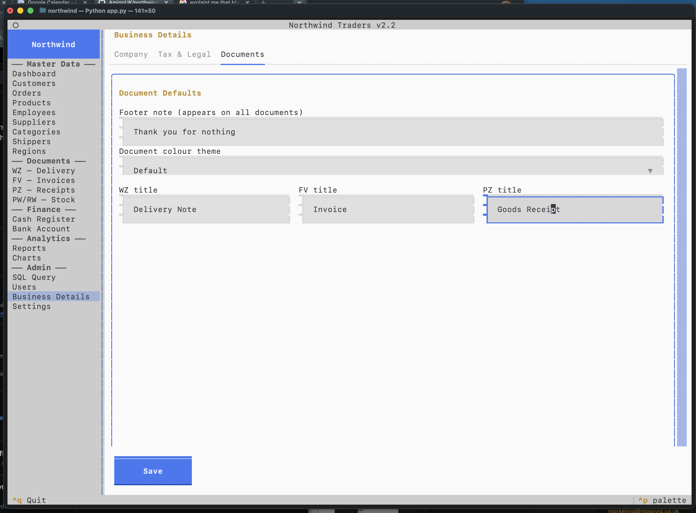</a><br/>
      <sub><b>Business Details — tabbed layout (v2.2)</b></sub>
    </td>
    <td align="center">
      <a href="screenshots/general-settings.png">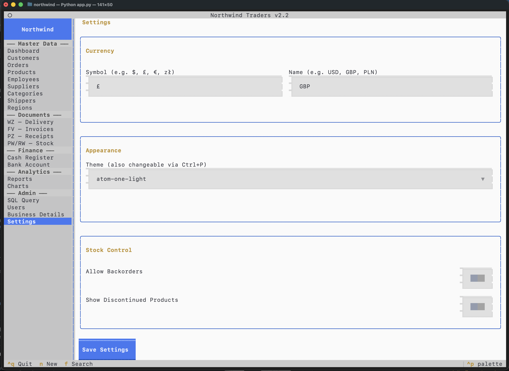</a><br/>
      <sub><b>General Settings panel</b></sub>
    </td>
  </tr>
</table>

---

## Installation

```bash
# 1. Clone
git clone git@github.com:AmigoUK/northwind.git
cd northwind

# 2. Install dependencies (Python 3.9+)
pip install -r requirements.txt

# 3. (macOS) Ensure pip-installed scripts are on PATH
#    Add to ~/.zshrc or ~/.bashrc:
export PATH="$PATH:$(python3 -m site --user-base)/bin"

# 4. Run
python3 app.py
```

Default login: **username** `admin` / **PIN** `1234`

---

## Dependencies

| Package | Version | Purpose |
|---------|---------|---------|
| `textual` | ≥ 0.80.0 | TUI framework |
| `plotext` | ≥ 5.2 | ASCII charts in terminal (v2.0) |
| `fpdf2` | ≥ 2.7 | PDF generation — branded delivery notes & invoices (v2.1) |
| `Pillow` | ≥ 10.0 | Company logo embedding in PDFs; QR image conversion (v2.1, v2.14) |
| `qrcode` | ≥ 7.4 | QR code generation for all PDF document types (v2.14) |

Install all at once:
```bash
pip install -r requirements.txt
```

---

## Project Structure

```
northwind/
├── app.py              # Textual App entry point, login flow, sidebar nav
├── db.py               # SQLite schema DDL + seed data
├── pdf_export.py       # PDF generation for all document types (v2.1–v2.14)
├── northwind.tcss      # Textual CSS (layout, modals, panels, charts)
├── requirements.txt    # Python dependencies
├── assets/             # Static assets — company logo copied here via Business Details browse
├── CLAUDE.md           # Claude Code context — per-commit checklist, architecture notes
├── data/               # Data-access layer (pure SQL, no UI)
│   ├── settings.py     # AppSettings key-value store (currency, theme, business details)
│   ├── users.py        # AppUsers CRUD + PIN authentication + role hierarchy (v2.4)
│   ├── dashboard.py    # KPI aggregations + kpis_extended()
│   ├── reports.py      # 12 report queries (sales, stock, trend, overdue, supplier spending…)
│   ├── delete_guards.py # Centralized delete guards + side-effect handlers (v2.4)
│   ├── dn.py           # DN (Delivery Note) CRUD + issue + cancel workflow
│   ├── inv.py          # INV (Invoice) CRUD + cancel
│   ├── cn.py           # CN (Credit Note) CRUD + business logic (v2.4)
│   ├── gr.py           # GR (Goods Receipt) CRUD + cancel
│   ├── si_so.py        # SI/SO (Stock Issue / Stock Out) CRUD
│   ├── cash.py         # Cash Register entries (CR/CP)
│   ├── bank.py         # Bank Account entries
│   ├── reconciliation.py # AR/AP reconciliation queries, aging, allocation (v2.13)
│   └── ...             # customers, orders, products, employees, …
├── screens/            # Textual Widget subclasses (one per section)
│   ├── login.py        # LoginScreen modal (PIN gate)
│   ├── dashboard.py    # Dashboard KPI cards + recent orders
│   ├── charts.py       # Charts panel — Sales Trend / Category Mix / Employees / Cash & Bank Account
│   ├── reports.py      # Reports panel with 12 report types + CSV export
│   ├── cn.py           # CN Credit Notes panel + creation wizard + detail modal (v2.4)
│   ├── modals.py       # Shared modals: ConfirmDelete, CleanDatabase, TestModeWarning, FileSelectModal (v2.8, v2.16)
│   ├── export_helpers.py # Centralized CSV export logic + FileSelectModal integration (v2.8)
│   ├── dn.py           # DN Delivery Notes panel + modals + cancel button
│   ├── inv.py          # INV Invoices panel + modals + CN integration
│   ├── gr.py           # GR Goods Receipts panel + modals + cancel button
│   ├── reconciliation.py # AR/AP Reconciliation panel — All Unpaid + Statement sub-views (v2.13)
│   ├── help.py         # Help panel — searchable topics + context-sensitive open_with_context() (v2.15)
│   └── ...             # sql, settings, business, users, cash, bank, …
└── tests/              # Automated test suite — 172 tests across 8 modules
    ├── conftest.py     # Fresh temp DB per test
    ├── test_data.py    # Core business logic (19 tests)
    ├── test_delete_guards.py  # Delete guards + side-effects (26 tests)
    ├── test_cancellation.py   # DN/INV/GR cancellation (13 tests)
    ├── test_cn.py             # Credit Notes — all 3 types (24 tests)
    ├── test_csv_import.py     # CSV import round-trip + alias mapping (28 tests)
    ├── test_demo.py           # Demo data insert / clean / has_demo_data (48 tests)
    └── test_reconciliation.py # AR/AP reconciliation + All Unpaid queries (14 tests)
```

---

## Key Bindings

| Key | Action |
|-----|--------|
| `ctrl+Q` | Quit (shows confirmation dialog) |
| `N` | New record (in active panel) |
| `F` | Focus search box (in active panel) |
| `ctrl+r` | Run SQL query (SQL Query panel) |
| `ctrl+X` | Export current view to CSV |
| `ctrl+I` | Import CSV into current panel |
| `R` | Refresh (Dashboard / Charts / Reports) |
| `U` | Switch to All Unpaid view (Reconciliation panel) |
| `S` | Switch to Statement view (Reconciliation panel) |
| `P` | Pay selected Invoice (Reconciliation panel) |
| `?` | Open Help (context-sensitive — jumps to topic for the active panel) |
| `ESC` | Close modal / go back |

---

## What I Learned

| Concept | Where it appears |
|---------|-----------------|
| SQLite with `sqlite3` — CRUD, JOINs, aggregations, transactions | `db.py`, `data/*.py` |
| `cursor.description` to read column names dynamically | `screens/sql.py` |
| `INSERT OR REPLACE` as a key-value upsert | `data/settings.py` |
| `hashlib.sha256` for one-way PIN hashing | `data/users.py` |
| Textual `ModalScreen` + `dismiss()` callback pattern | all form modals |
| Role-based UI (same app, different views per role) | `app.py` `_apply_role_visibility()` |
| Textual `ContentSwitcher` for single-page navigation | `app.py` |
| `TextArea` widget for multi-line code input | `screens/sql.py` |
| CSV export with Python's `csv` module + centralized helper pattern | `screens/export_helpers.py` |
| MVC-style layered architecture (`data/` + `screens/`) | whole project |
| CSS `1fr` columns for multi-column form rows | `northwind.tcss`, all form modals |
| `plotext` for ANSI ASCII charts inside Textual `Static` widgets | `screens/charts.py` |
| `TabbedContent` + `TabPane` for multi-view panels | `screens/charts.py`, regions |
| SQL window functions: `strftime`, `julianday`, `AVG` | `data/reports.py`, `data/dashboard.py` |
| Document workflow state machine (draft → issued) | `data/dn.py`, `data/inv.py`, `data/gr.py` |
| Key-value settings store for business/document config | `data/settings.py`, `screens/business.py` |
| `fpdf2` subclassing for custom footers and multi-column layouts | `pdf_export.py` |
| Embedding images and drawing shapes/lines with FPDF primitives | `pdf_export.py` |
| Reusable PDF helpers (`_draw_header`, `_draw_amount_box`, `_draw_signature_line`) shared across document types | `pdf_export.py` |
| Generating voucher-style single-entry PDFs (CR, CP, Bank) vs multi-line table PDFs (DN, INV, GR) | `pdf_export.py` |
| CSS selector specificity in Textual — type+class beats class alone; later rules win on equal specificity | `northwind.tcss` |
| `dock: bottom` to pin a widget (Save button) regardless of sibling content height | `northwind.tcss` |
| `overflow-y: auto` on `TabPane` to make long forms scrollable within a tab | `northwind.tcss` |
| `TabbedContent` inside a panel to split a long settings page into navigable tabs | `screens/business.py` |
| Grouping related fields into 2- and 3-column `form-row` layouts to reduce vertical height | `screens/business.py` |
| Merging redundant sections (Company Identity + Contact Details) into one compact block | `screens/business.py` |
| Balancing widget height (Select `height: 2`) vs readability to keep forms within one screen | `northwind.tcss` |
| Hierarchical RBAC — numeric role levels with `has_permission()` comparator | `data/users.py` |
| Centralized delete guards returning `(bool, list[str])` reason tuples | `data/delete_guards.py` |
| Side-effect handlers that run before DELETE — payment reversal, stock restoration | `data/delete_guards.py` |
| Document cancellation as a state-machine transition with audit fields (CancelledAt/By/Reason) | `data/dn.py`, `data/inv.py`, `data/gr.py` |
| Credit note (CN) pattern — recording original vs corrected values per line item | `data/cn.py` |
| In-place INV.TotalNet adjustment on CN creation + status recalculation | `data/cn.py` |
| Multi-step creation wizard in a single ModalScreen (pick INV → type → items → confirm) | `screens/cn.py` |
| `conn.execute()` vs `conn.executescript()` for reliable schema migration on existing databases | `db.py` |
| pytest fixtures with `tmp_path` for isolated per-test SQLite databases | `tests/conftest.py` |
| Testing cross-document effects: Order → DN → INV → CR → CN → verify all balances | `tests/test_cn.py` |
| Textual `DirectoryTree` subclassing with `filter_paths()` for extension-based file filtering | `screens/modals.py` |
| Stacking `ModalScreen` instances — pushing a file browser from within an import modal | `screens/modals.py` |
| Extracting duplicated logic into a shared helper with callback-based modal integration | `screens/export_helpers.py` |
| Header alias maps with `setdefault` to accept multiple CSV column naming conventions without overriding exact matches | `data/csv_import.py` |
| `qrcode` library — `QRCode(version=None, fit=True)` for auto-sizing; `ERROR_CORRECT_M` for 15 % damage tolerance | `pdf_export.py` |
| `tempfile.NamedTemporaryFile(delete=False)` pattern: close handle inside `with`, then read file, then `os.remove()` — required on Windows | `pdf_export.py` |
| `.convert("RGB")` to strip PNG alpha channel before fpdf2 embedding | `pdf_export.py` |
| Defensive `try/except Exception: pass` wrapper so QR failure never aborts PDF generation | `pdf_export.py` |
| `shutil.copy2()` to copy a user-selected file into the app's `assets/` folder with metadata preserved | `screens/business.py` |
| Python 3.9 compat — `X \| Y` union type syntax requires 3.10+; use `Optional[X]` or omit annotation | `screens/business.py` |
| Textual CSS specificity trap — `.parent Vertical` (0-1-1) beats `.child-class` (0-1-0); fix with 3-part `Widget .section Vertical` rule (0-1-2) | `northwind.tcss` |
| JOIN vs LEFT JOIN in date-filtered reports — LEFT JOIN includes rows outside the date range; JOIN excludes them correctly | `data/reports.py` |
| Scoped KPI query `kpis_for_period(date_from, date_to)` for period-specific charts bar vs global `kpis_extended()` | `data/dashboard.py` |
| Context-sensitive navigation — storing a `{section_id: search_term}` map and calling `open_with_context()` to pre-filter the Help panel from any active panel | `app.py`, `screens/help.py` |
| `Switch.Changed` async timing trap — setting `.value` enqueues the message rather than dispatching it in-place; a `_mode_switching` boolean flag is already `False` before the message fires; robust fix: compare `event.value` against the persisted DB state | `screens/settings.py` |
