# Northwind Traders TUI

A terminal-based CRUD application for the classic **Northwind** sample database,
built with **Python + Textual + SQLite** as a university learning project.

---

## Features

- **9 CRUD panels** — Customers, Orders, Products, Employees, Suppliers, Categories,
  Shippers, Regions, Reports
- **Dashboard** with live KPIs (customers, orders, low-stock count, total revenue)
- **SQL Query editor** — type any SQL, press `ctrl+r`, see results in a table
- **Reports** with CSV export (sales by customer, product, employee, date range…)
- **Configurable currency** — symbol and name saved to SQLite ($ → £ → € etc.)
- **PIN-based login** with role management (admin / user)
- **Role-based UI** — admin sees SQL Query, Users, and Settings panels; regular users do not
- **Compact multi-column form modals** — related fields (name, address, dates) displayed
  side-by-side using CSS `1fr` columns, reducing modal height and eliminating scrolling

---

## Screenshots

> Click any thumbnail to view full size.

### Main panels

<table>
  <tr>
    <td align="center">
      <a href="screenshots/dashboard.png"></a><br/>
      <sub><b>Dashboard</b></sub>
    </td>
    <td align="center">
      <a href="screenshots/customers.png">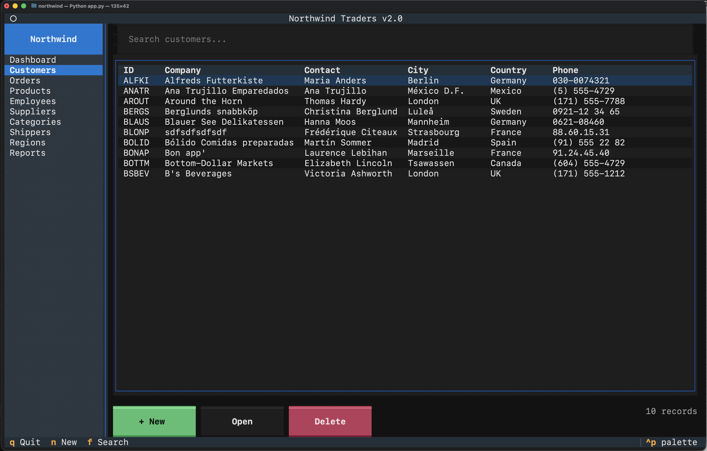</a><br/>
      <sub><b>Customers</b></sub>
    </td>
    <td align="center">
      <a href="screenshots/orders.png">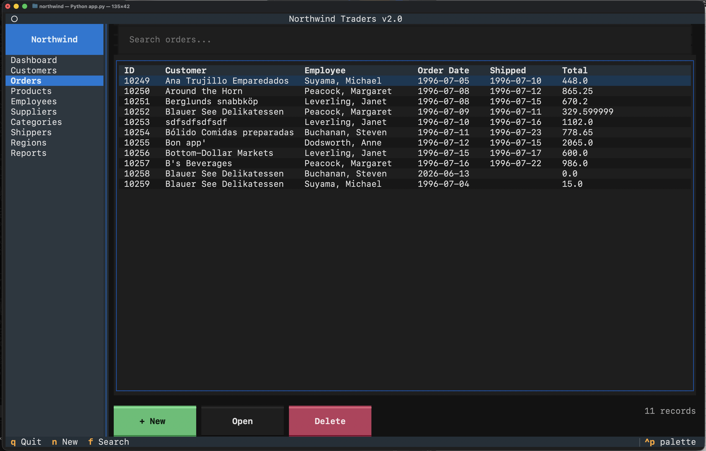</a><br/>
      <sub><b>Orders</b></sub>
    </td>
  </tr>
  <tr>
    <td align="center">
      <a href="screenshots/products.png"></a><br/>
      <sub><b>Products</b></sub>
    </td>
    <td align="center">
      <a href="screenshots/employees.png">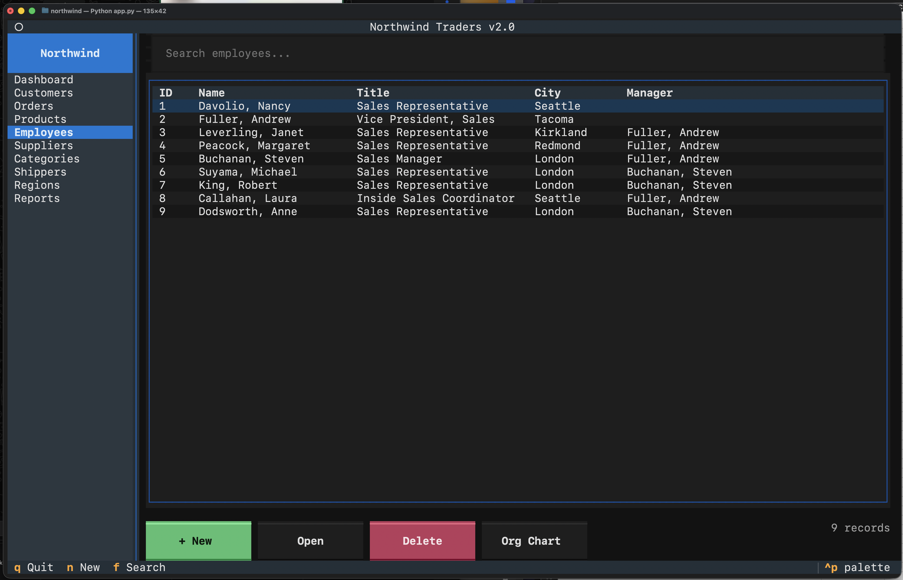</a><br/>
      <sub><b>Employees</b></sub>
    </td>
    <td align="center">
      <a href="screenshots/supliers.png">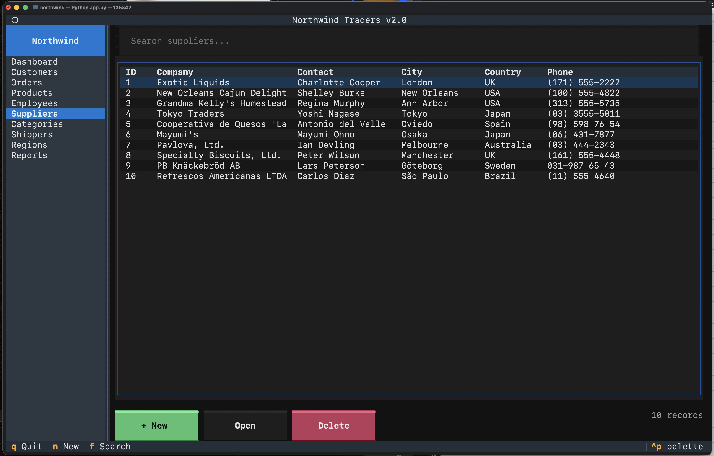</a><br/>
      <sub><b>Suppliers</b></sub>
    </td>
  </tr>
  <tr>
    <td align="center">
      <a href="screenshots/categories.png">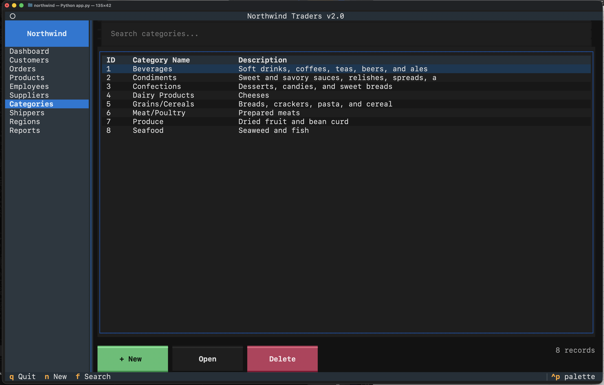</a><br/>
      <sub><b>Categories</b></sub>
    </td>
    <td align="center">
      <a href="screenshots/shippers.png">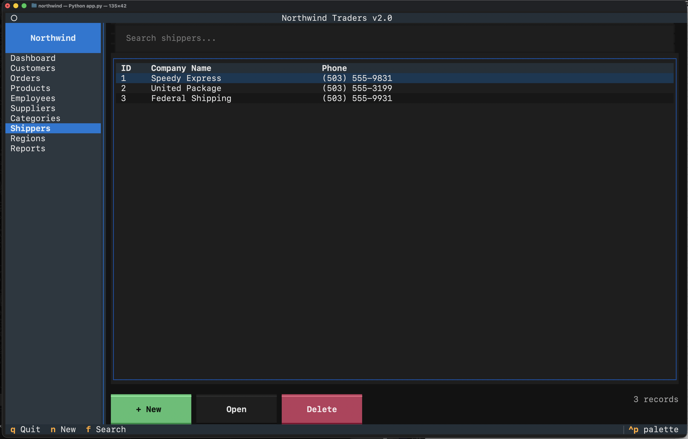</a><br/>
      <sub><b>Shippers</b></sub>
    </td>
    <td align="center">
      <a href="screenshots/regions and terretories1.png"></a><br/>
      <sub><b>Regions &amp; Territories</b></sub>
    </td>
  </tr>
</table>

### Admin &amp; advanced features

<table>
  <tr>
    <td align="center">
      <a href="screenshots/sql-query.png"></a><br/>
      <sub><b>SQL Query editor</b></sub>
    </td>
    <td align="center">
      <a href="screenshots/usermanagement.png">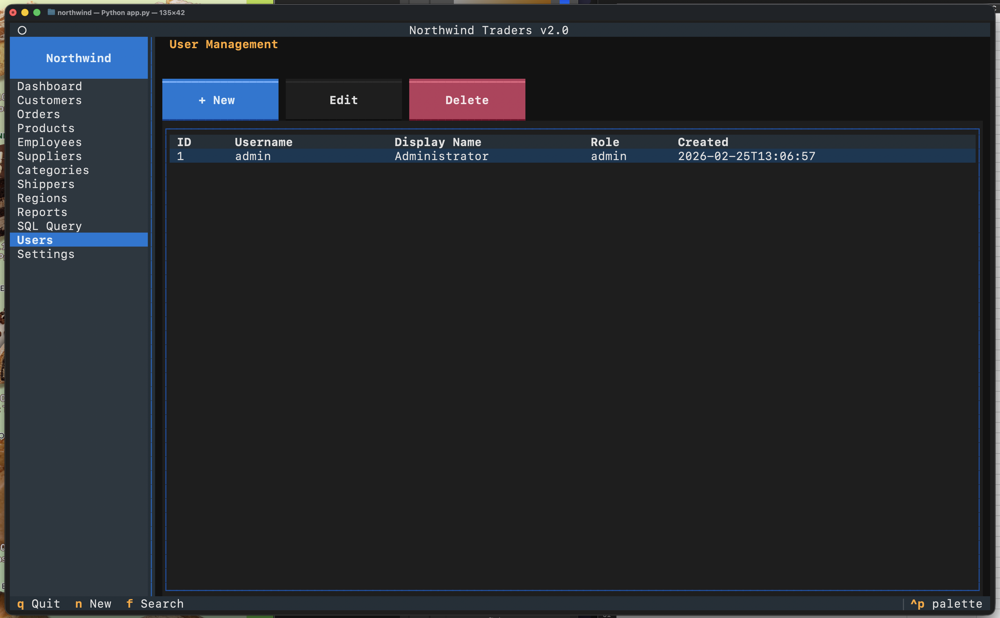</a><br/>
      <sub><b>User Management</b></sub>
    </td>
    <td align="center">
      <a href="screenshots/settings-currency.png">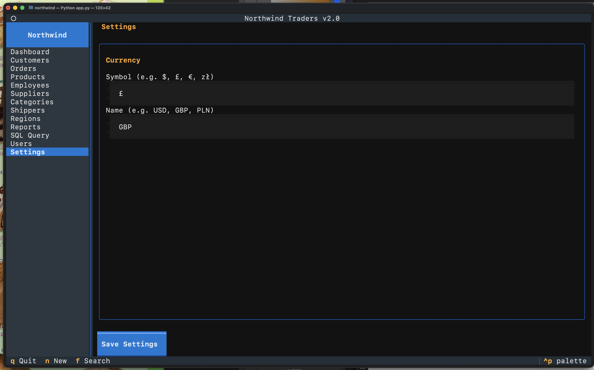</a><br/>
      <sub><b>Currency Settings</b></sub>
    </td>
  </tr>
  <tr>
    <td align="center">
      <a href="screenshots/reports.png">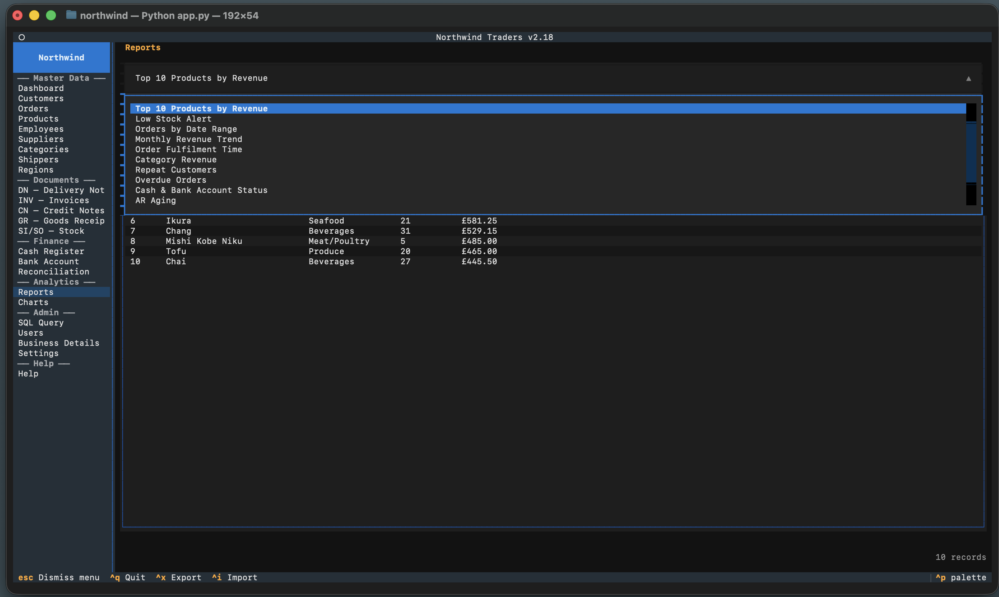</a><br/>
      <sub><b>Reports</b></sub>
    </td>
    <td align="center">
      <a href="screenshots/csv export.png"></a><br/>
      <sub><b>CSV Export</b></sub>
    </td>
    <td align="center">
      <a href="screenshots/settings.png">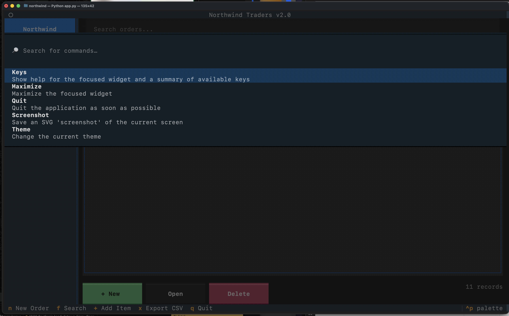</a><br/>
      <sub><b>Settings</b></sub>
    </td>
  </tr>
</table>

### Forms &amp; modals in action

<table>
  <tr>
    <td align="center">
      <a href="screenshots/better-modal-windows.png">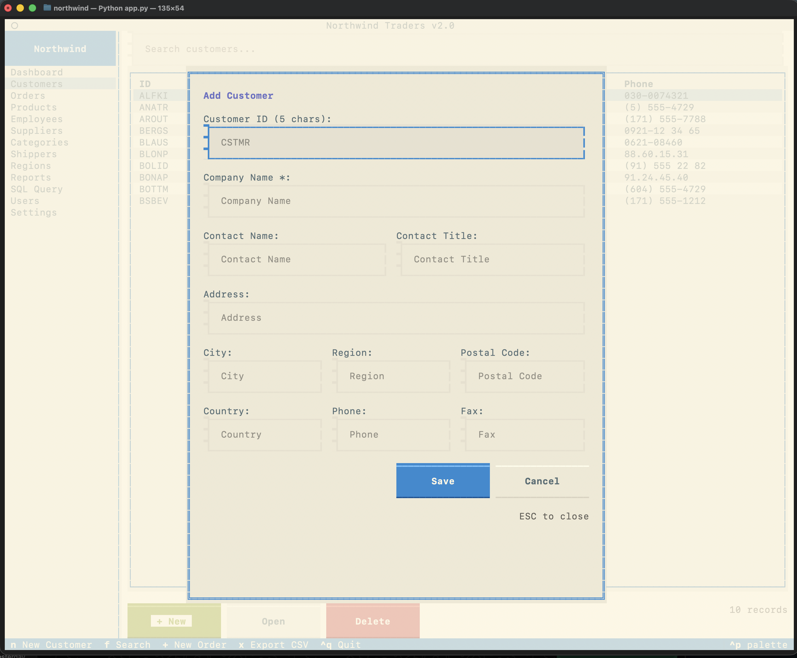</a><br/>
      <sub><b>Multi-column form (Customer)</b></sub>
    </td>
    <td align="center">
      <a href="screenshots/better-modal-windows2.png">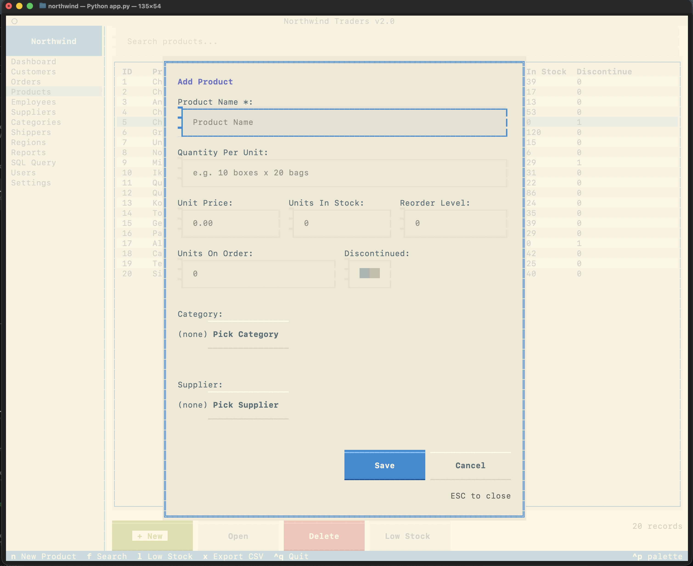</a><br/>
      <sub><b>Multi-column form (Employee)</b></sub>
    </td>
    <td align="center">
      <a href="screenshots/modal3.png">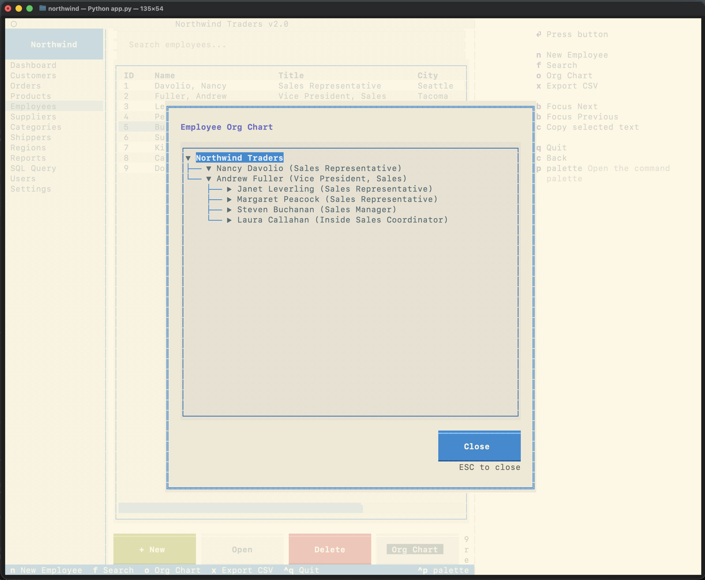</a><br/>
      <sub><b>Multi-column form (Order)</b></sub>
    </td>
  </tr>
  <tr>
    <td align="center">
      <a href="screenshots/adding customer.png"></a><br/>
      <sub><b>Adding a customer (before)</b></sub>
    </td>
    <td align="center">
      <a href="screenshots/new order.png"></a><br/>
      <sub><b>New order (before)</b></sub>
    </td>
    <td align="center">
      <a href="screenshots/editing existing order.png"></a><br/>
      <sub><b>Editing an order (before)</b></sub>
    </td>
  </tr>
</table>

---

## Installation

```bash
# 1. Clone
git clone <repo-url>
cd northwind

# 2. Install dependencies (requires Python 3.10+)
pip install -r requirements.txt

# 3. Run
python3 app.py
```

Default login: **username** `admin` / **PIN** `1234`

---

## Project Structure

```
northwind/
├── app.py              # Textual App entry point, login flow, sidebar
├── db.py               # SQLite schema DDL + seed data
├── northwind.tcss      # Textual CSS (layout, modals, panels)
├── data/               # Data-access layer (pure SQL, no UI)
│   ├── settings.py     # AppSettings key-value store (currency etc.)
│   ├── users.py        # AppUsers CRUD + PIN authentication
│   ├── dashboard.py    # KPI aggregations
│   ├── reports.py      # Report queries (sales, stock, date range)
│   └── ...             # customers, orders, products, employees, …
└── screens/            # Textual Widget subclasses (one per section)
    ├── login.py        # LoginScreen modal (PIN gate)
    ├── sql.py          # SQL Query panel
    ├── settings.py     # Settings panel
    ├── users.py        # User management panel
    ├── dashboard.py    # Dashboard KPI + recent orders
    └── ...             # customers, orders, products, employees, …
```

---

## What I Learned

| Concept | Where it appears |
|---------|-----------------|
| SQLite with `sqlite3` — CRUD, JOINs, aggregations, transactions | `db.py`, `data/*.py` |
| `cursor.description` to read column names dynamically | `screens/sql.py` |
| `INSERT OR REPLACE` as a key-value upsert | `data/settings.py` |
| `hashlib.sha256` for one-way PIN hashing | `data/users.py` |
| Textual `ModalScreen` + `dismiss()` callback pattern | `screens/login.py`, all form modals |
| Role-based UI (same app, different views per role) | `app.py` `_apply_role_visibility()` |
| Textual `ContentSwitcher` for single-page navigation | `app.py` |
| `TextArea` widget for multi-line code input | `screens/sql.py` |
| CSV export with Python's `csv` module | `screens/sql.py`, reports |
| MVC-style layered architecture (`data/` + `screens/`) | whole project |
| Textual CSS `1fr` columns (`Horizontal` + `Vertical`) for multi-column form rows | `northwind.tcss`, all form modals |

---

## Key Bindings

| Key | Action |
|-----|--------|
| `ctrl+Q` | Quit (shows confirmation dialog) |
| `N` | New record (in active panel) |
| `F` | Focus search box (in active panel) |
| `ctrl+r` | Run SQL query (SQL Query panel) |
| `X` | Export current results to CSV (SQL Query panel) |
| `R` | Refresh dashboard |
| `ESC` | Close modal / go back |
