# Northwind Traders TUI

A terminal-based warehouse and distribution management system built on the classic
**Northwind** sample database. Stack: **Python + Textual + SQLite**.

Covers the full order-to-cash and purchase-to-pay cycles: **Sales Orders → Delivery Notes
(DN) → Invoices (INV)** (multiple DNs can be consolidated into one invoice), **Goods
Receipts (GR)** for inbound stock from suppliers, and a **Cash Register + Bank Account**
for tracking payments in both directions. The **Reconciliation** panel provides an AR/AP
control centre — an "All Unpaid" view across all customers or suppliers, switchable to a
per-entity statement with running balance. All seven document types export to branded A4
PDF with QR codes. Role-based access (admin / manager / user), a searchable Help panel,
12 report types with CSV export, and 172+ automated tests complete the picture.

## Contents

[Version History](#version-history) · [Changelog](CHANGELOG.md) · [Screenshots](#screenshots) · [Installation](#installation) · [Dependencies](#dependencies) · [Project Structure](#project-structure) · [Key Bindings](#key-bindings) · [What I Learned](#what-i-learned)

---

## Version History

| Version | Theme | Key additions |
|---------|-------|---------------|
| **v1.4** | Foundation | 9 CRUD panels, SQL editor, 6 reports + CSV export, PIN login, role-based UI, multi-column form modals |
| **v2.0** | Documents & Finance | Document workflow (DN/INV/GR/SI/SO), Cash Register & Bank Account, Charts, extended KPIs, 7 UX enhancements, finance dashboard KPIs |
| **v2.1** | PDF Export | Branded A4 PDF delivery notes (DN) & invoices (INV) — company logo, theme colours, totals, linked DN references |
| **v2.2** | PDF All Docs + UX | PDF export for GR, CR, CP & Bank entries; Business Details tabbed layout with docked Save button |
| **v2.3** | UI Polish | Business Details compact one-screen tabs; form layout optimisation across Company / Tax / Documents |
| **v2.4** | Data Integrity | 3-tier roles (user/manager/admin), delete guards, document cancellation, Credit Notes (CN), 82 automated tests |
| **v2.5** | English International | All Polish abbreviations replaced with English (WZ→DN, FV→INV, FK→CN, PZ→GR, PW→SI, RW→SO, KP→CR, KW→CP) |
| **v2.6** | UI Polish | Wider modals, stretch Select/Button widgets, compact picker layout |
| **v2.7** | CSV Import | CSV import for master data — Customers, Suppliers, Products, Categories |
| **v2.8** | File Selector & Export Cleanup | File browser modal for all exports/imports, centralized CSV export logic |
| **v2.9** | CSV Round-Trip Fix | CSV import now accepts export display headers (ID, Company, Contact…) via alias mappings |
| **v2.10** | Import/Export Fixes | Fix Ctrl+X/Ctrl+I keybindings globally; fix Products & Orders CSV import column mappings |
| **v2.13** | AR/AP All Unpaid View | Reconciliation panel default "All Unpaid" view across all customers/suppliers; optional entity filter; sub-view toggle (All Unpaid / Statement) |
| **v2.14** | QR Codes on PDFs | QR code embedded in every PDF document header; toggle in Business Details → Documents; encodes doc type, number, date, counterparty, amount |
| **v2.15** | Help System | Searchable help panel with FAQ category; context-sensitive `?` shortcut jumps to the relevant topic for the active panel |
| **v2.16** | Demo Data UX | Test/Production mode switch in Settings; PIN-protected `TestModeWarningModal`; "Clean Database" modal clarifies what is preserved |
| **v2.17** | Cash Register Integrity | Non-negative cash balance enforced at the data layer; GR cash payments fall back to bank when cash is insufficient; demo data generation never produces a negative cash register |
| **v2.18** | Backup on Quit | Ctrl+Q dialog upgraded to Cancel / Quit / Backup & Quit; timestamped SQLite backup written to repo root with toast notification |

---

> Full release notes for each version: **[CHANGELOG.md](CHANGELOG.md)**

## Screenshots

> Click any thumbnail to view full size.

**Sections:** [Login](#login) · [Dashboard & Analytics](#dashboard--analytics) · [Master Data](#master-data) · [Order → Delivery Note Workflow](#order--delivery-note-workflow) · [Invoices & Credit Notes](#invoices--credit-notes) · [Goods Receipts & Stock](#goods-receipts--stock) · [Finance — Cash & Bank](#finance--cash--bank) · [Reconciliation](#reconciliation) · [Admin & Settings](#admin--settings) · [Help & Keyboard](#help--keyboard)

---

### Login

PIN-based login gate — the first screen users see on every launch. The app supports multiple user accounts with three roles (admin / manager / user); admin-only panels (SQL editor, Users, Business Details, Settings) are hidden from the sidebar for non-admin logins.

<table>
  <tr>
    <td align="center">
      <a href="screenshots/login-window.png">
        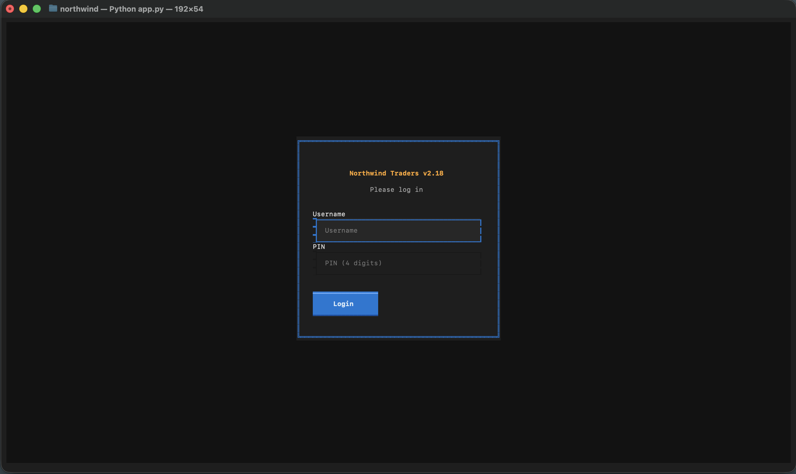
      </a><br/>
      <sub><b>Login — PIN authentication</b></sub>
    </td>
  </tr>
</table>

---

### Dashboard & Analytics

The dashboard displays 10 KPI cards updated in real time: Orders Today, Revenue MTD, Low Stock alert count, Pending Orders, Average Fulfilment Days, month-over-month trend arrow, Cash Register balance, Bank Account balance, Open Invoices, and Open DNs. The Charts panel plots a Sales Trend sparkline, Top Products bar chart, and Top Employees bar chart (press `R` to refresh). The Reports panel offers 11 report types with a date-range filter and CSV export.

<table>
  <tr>
    <td align="center">
      <a href="screenshots/dashboard.png">
        
      </a><br/>
      <sub><b>Dashboard — 10 KPI cards</b></sub>
    </td>
    <td align="center">
      <a href="screenshots/charts.png">
        
      </a><br/>
      <sub><b>Charts — Sales Trend + bar charts</b></sub>
    </td>
    <td align="center">
      <a href="screenshots/reports.png">
        
      </a><br/>
      <sub><b>Reports — 11 types + date-range filter</b></sub>
    </td>
  </tr>
</table>

---

### Master Data

Seven CRUD panels cover the core reference data: Customers, Orders, Products, Employees, Suppliers, Categories, Shippers, and Regions. Every list view supports live search (`F`), keyboard navigation, and a detail modal (`Enter`) for editing. Products track stock levels with a Low Stock toggle; discontinued products can be hidden via Settings.

<table>
  <tr>
    <td align="center">
      <a href="screenshots/customers-lv.png">
        
      </a><br/>
      <sub><b>Customers — list with live filter</b></sub>
    </td>
    <td align="center">
      <a href="screenshots/customers-dv-edit.png">
        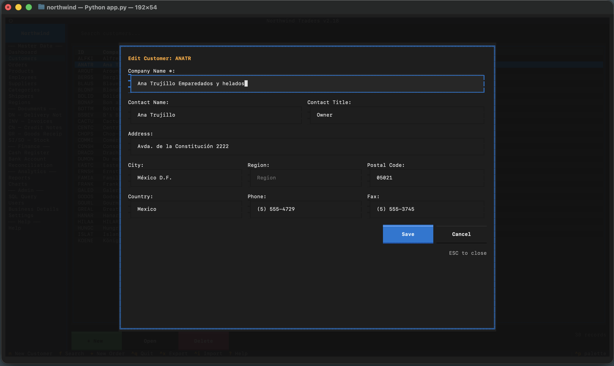
      </a><br/>
      <sub><b>Customer — detail / edit modal</b></sub>
    </td>
    <td align="center">
      <a href="screenshots/orders-lv.png">
        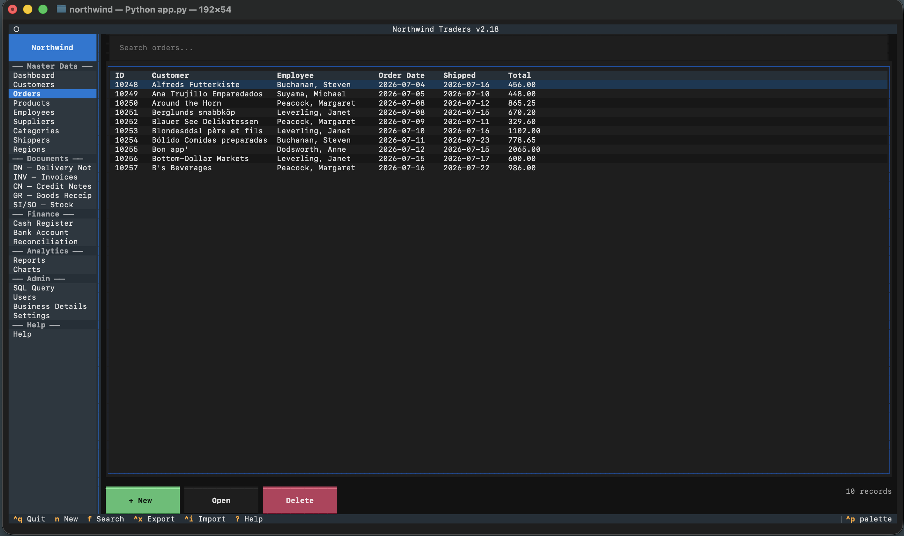
      </a><br/>
      <sub><b>Orders — list view</b></sub>
    </td>
    <td align="center">
      <a href="screenshots/products-lv.png">
        
      </a><br/>
      <sub><b>Products — list with stock levels</b></sub>
    </td>
  </tr>
</table>

---

### Order → Delivery Note Workflow

The core outbound flow converts a Sales Order into one or more Delivery Notes (DN) and then into Invoices. From the Order detail, press `D` to create a DN pre-populated with the order lines; products with insufficient stock are flagged (stock-control mode is configurable). Each DN can be exported to a branded A4 PDF — with or without pricing, with an embedded QR code, and with a related-document log at the bottom. Pressing `N` from the DN list creates a new standalone DN without an underlying order.

<table>
  <tr>
    <td align="center">
      <a href="screenshots/orders-dv-posible-action.png">
        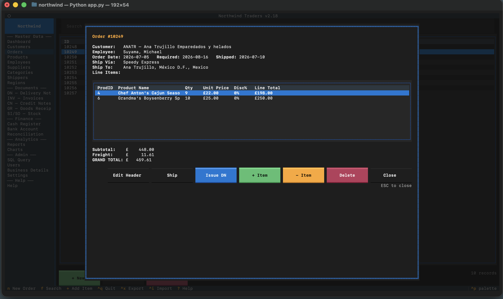
      </a><br/>
      <sub><b>Order detail — available actions</b></sub>
    </td>
    <td align="center">
      <a href="screenshots/orders-dn-add-product-dynamic-filter.png">
        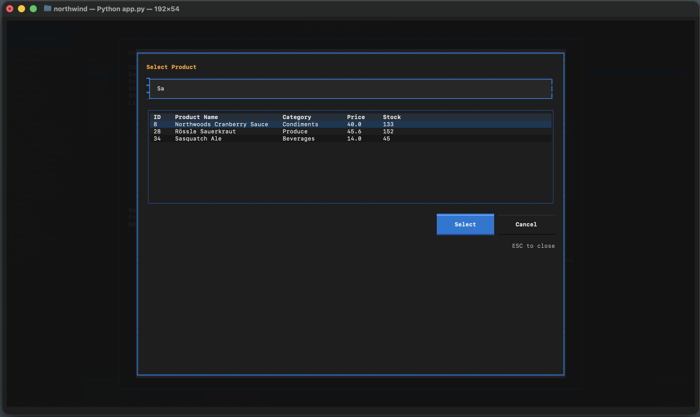
      </a><br/>
      <sub><b>DN — adding product (dynamic filter)</b></sub>
    </td>
    <td align="center">
      <a href="screenshots/transforming-order-to-dn.png">
        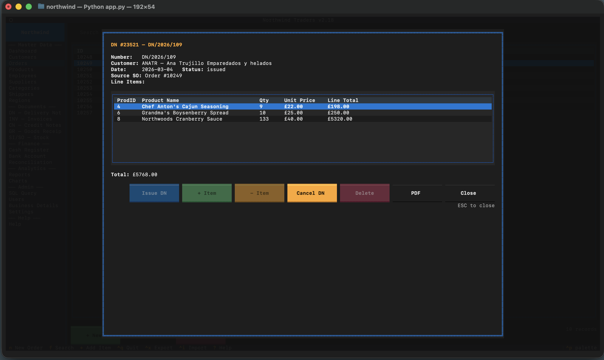
      </a><br/>
      <sub><b>Converting Order → Delivery Note</b></sub>
    </td>
    <td align="center">
      <a href="screenshots/dn-stock-contr.png">
        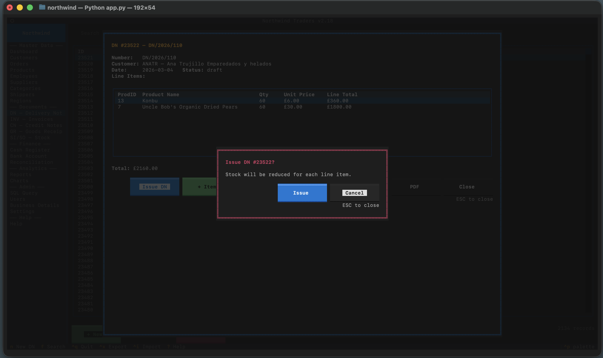
      </a><br/>
      <sub><b>DN — stock-control validation</b></sub>
    </td>
  </tr>
  <tr>
    <td align="center">
      <a href="screenshots/dn-without-pricing.png">
        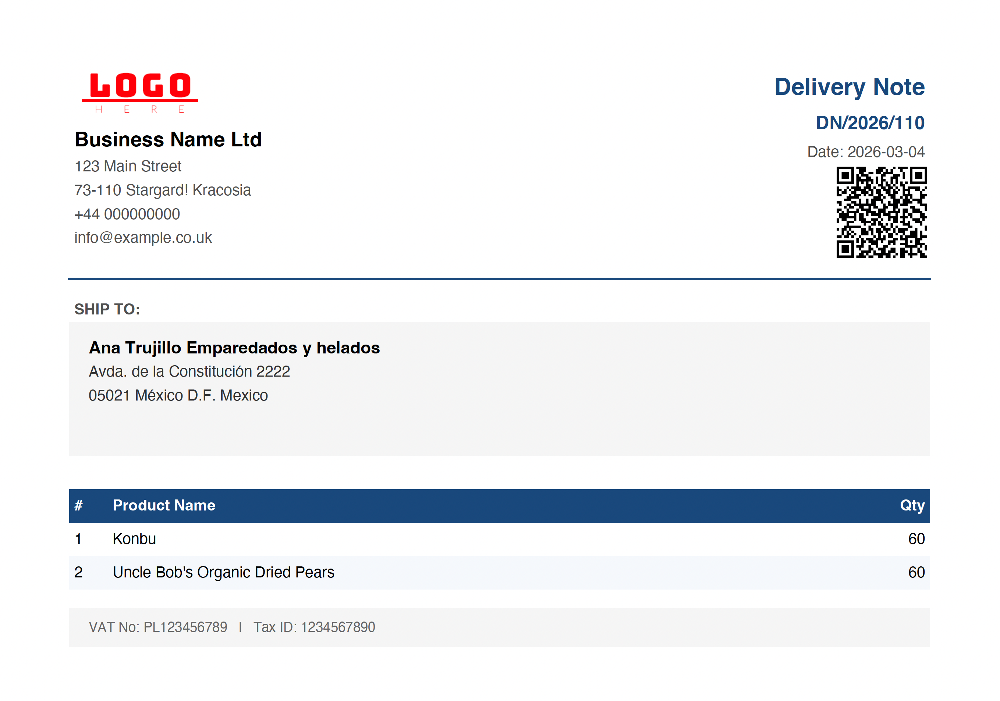
      </a><br/>
      <sub><b>DN PDF — pricing hidden (configurable)</b></sub>
    </td>
    <td align="center">
      <a href="screenshots/saving-dn-pdf.png">
        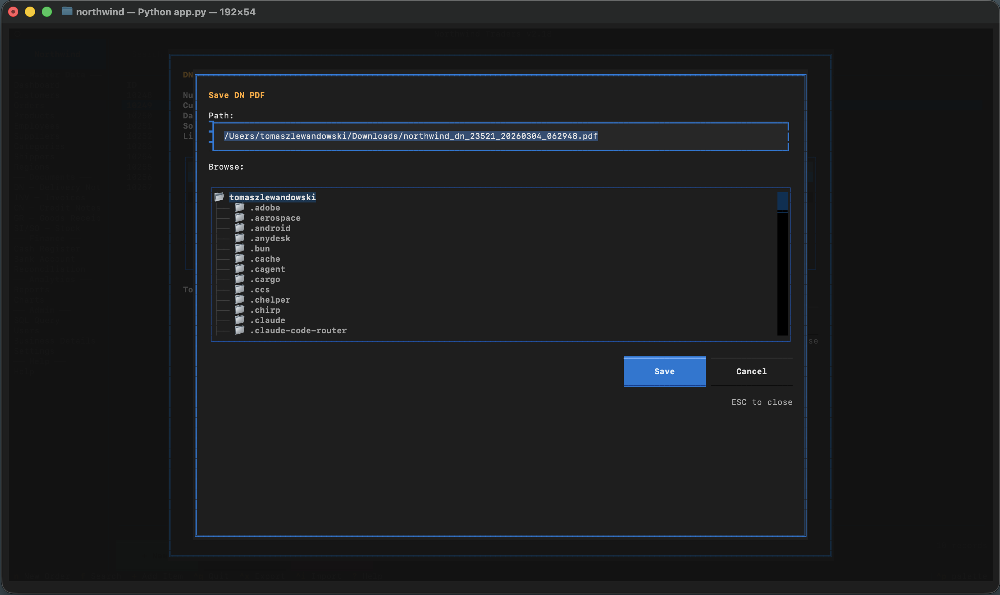
      </a><br/>
      <sub><b>Saving DN as branded A4 PDF</b></sub>
    </td>
  </tr>
</table>

---

### Invoices & Credit Notes

An Invoice (INV) is generated from one or more approved Delivery Notes in a single action. The INV detail shows the linked DNs, payment terms, and outstanding balance. Paid invoices can be partially or fully settled; the All Unpaid view aggregates outstanding balances across all customers. When a billing error occurs, a Credit Note (CN) reverses specific line items against the original invoice. Both INV and CN export to PDF with a QR code.

<table>
  <tr>
    <td align="center">
      <a href="screenshots/new-inv-based-on-dn1.png">
        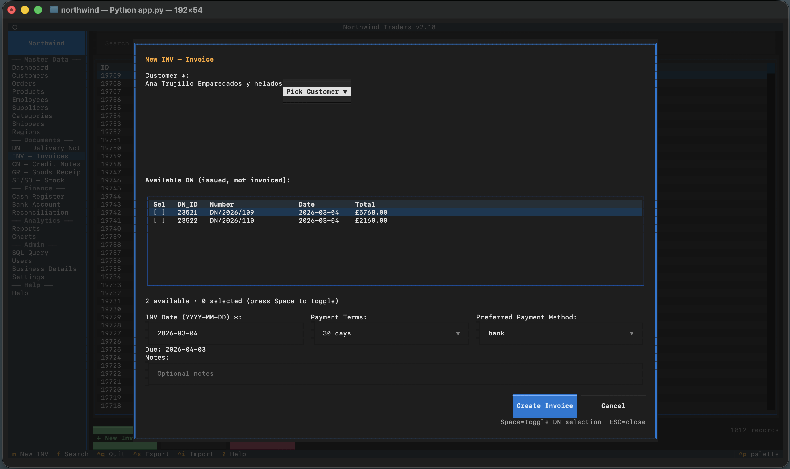
      </a><br/>
      <sub><b>Select DNs to invoice</b></sub>
    </td>
    <td align="center">
      <a href="screenshots/new-inv-based-on-dn2.png">
        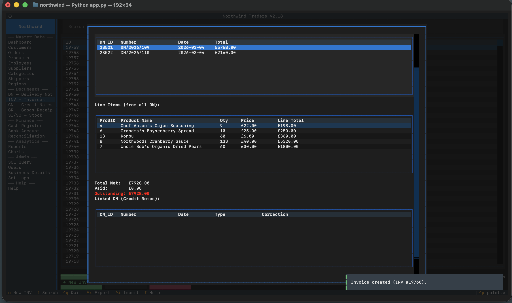
      </a><br/>
      <sub><b>Invoice preview from DNs</b></sub>
    </td>
    <td align="center">
      <a href="screenshots/new-inv-based-on-dn3-posible-actions.png">
        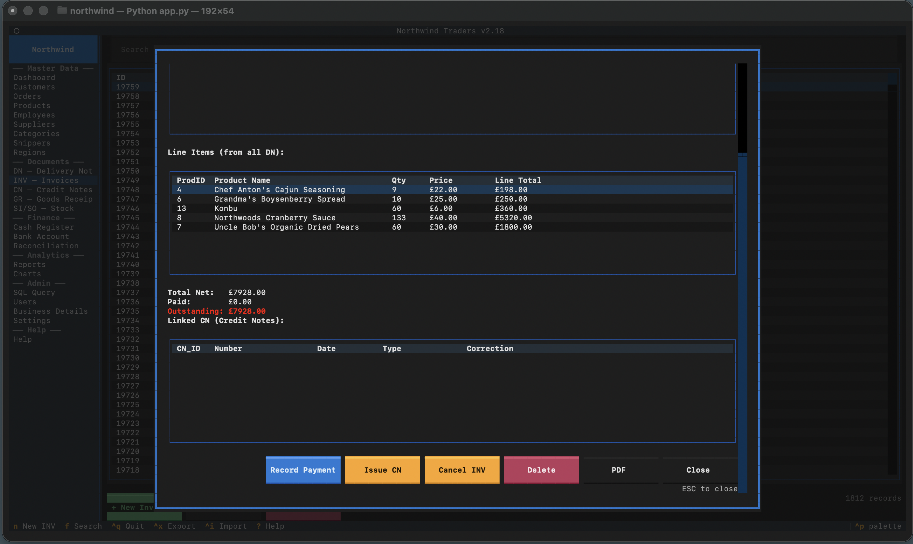
      </a><br/>
      <sub><b>Invoice detail — possible actions</b></sub>
    </td>
    <td align="center">
      <a href="screenshots/new-inv-based-on-dn4-pdf.png">
        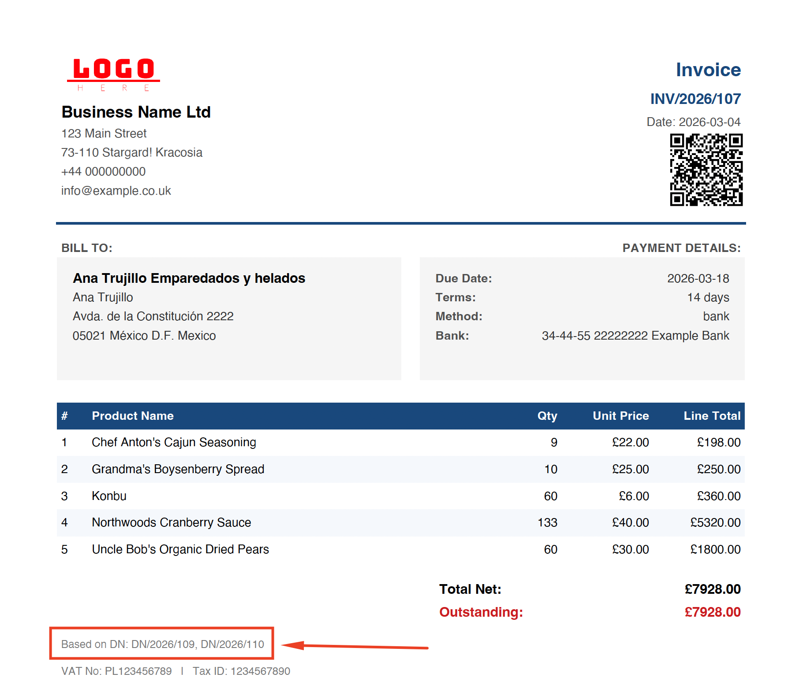
      </a><br/>
      <sub><b>Invoice exported to PDF</b></sub>
    </td>
  </tr>
</table>

---

### Goods Receipts & Stock

Goods Receipts (GR) record inbound deliveries from suppliers and automatically increase stock levels on confirmation. A GR can be paid via Cash or Bank at the point of entry; if the cash register balance is insufficient, the payment automatically falls back to the bank account (v2.17 integrity guard). Stock Issues (SI) and Stock Outs (SO) adjust inventory directly for write-offs or internal consumption.

<table>
  <tr>
    <td align="center">
      <a href="screenshots/stock-in-from-supplier.png">
        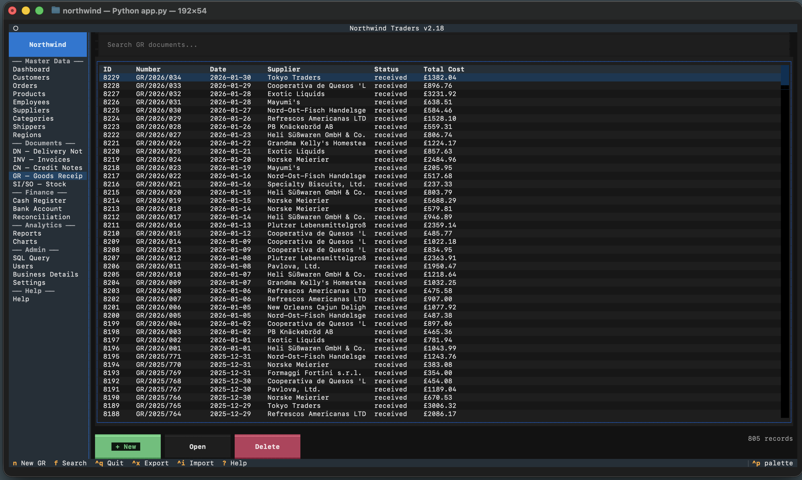
      </a><br/>
      <sub><b>GR — goods receipt list</b></sub>
    </td>
    <td align="center">
      <a href="screenshots/stock-in-from-supplier-dv.png">
        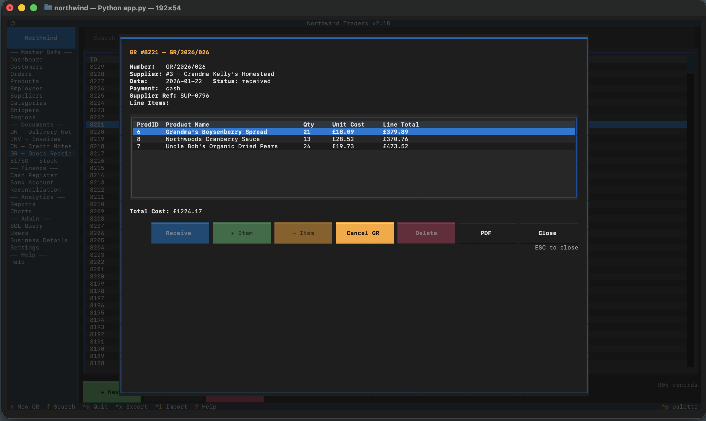
      </a><br/>
      <sub><b>GR — detail with supplier &amp; items</b></sub>
    </td>
  </tr>
</table>

---

### Finance — Cash & Bank

The Cash Register panel records Cash Receipts (CR) from customers and Cash Payments (CP) to suppliers, and shows a running balance. The balance can never go negative — any operation that would cause an overdraft is rejected with an error message. The Bank Account panel logs all electronic transfers and bank-backed GR payments. Both panels support PDF export for individual entries, and the Cash Register includes a one-click transfer-to-bank action.

<table>
  <tr>
    <td align="center">
      <a href="screenshots/cash-register-lv.png">
        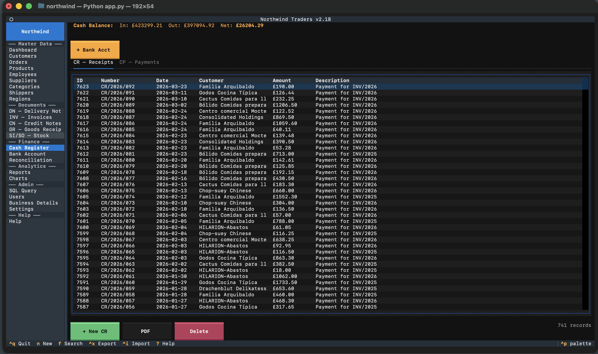
      </a><br/>
      <sub><b>Cash Register — CR/CP ledger</b></sub>
    </td>
    <td align="center">
      <a href="screenshots/cash-register-transfer2bank.png">
        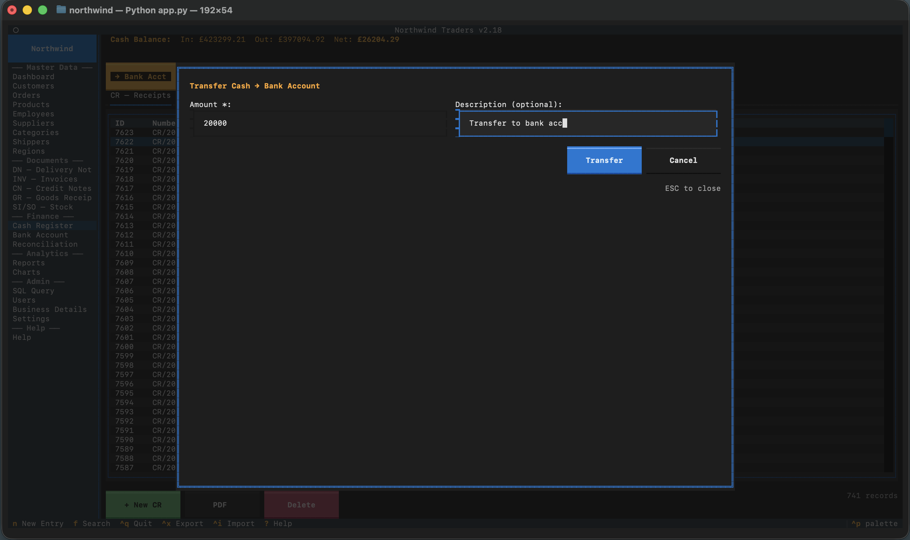
      </a><br/>
      <sub><b>Transfer cash → bank account</b></sub>
    </td>
    <td align="center">
      <a href="screenshots/cash-register-control-never-less-than-0.png">
        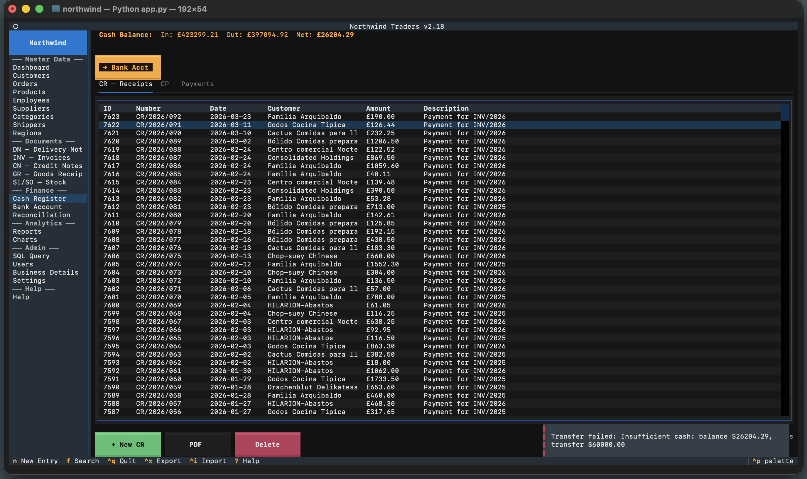
      </a><br/>
      <sub><b>Non-negative balance enforcement</b></sub>
    </td>
    <td align="center">
      <a href="screenshots/bank-acc-log.png">
        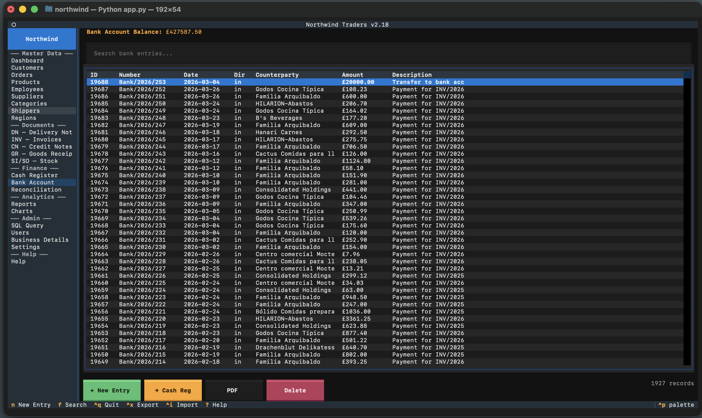
      </a><br/>
      <sub><b>Bank Account — entry log</b></sub>
    </td>
  </tr>
  <tr>
    <td align="center">
      <a href="screenshots/register-paym-from-customer.png">
        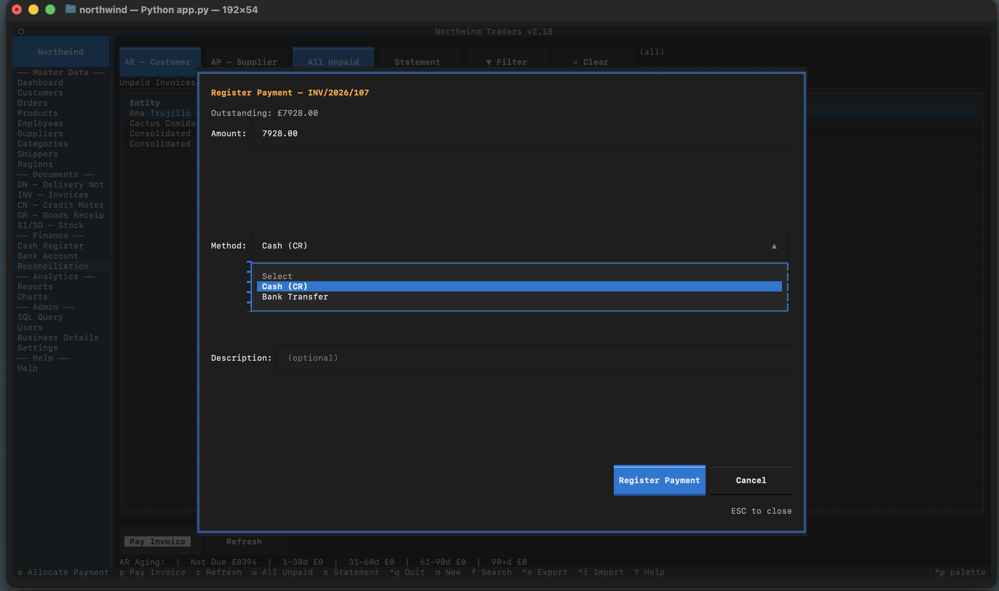
      </a><br/>
      <sub><b>Register customer payment (CR)</b></sub>
    </td>
  </tr>
</table>

---

### Reconciliation

The Reconciliation panel is the AR/AP control centre. The default "All Unpaid" view lists every open invoice across all customers (or all outstanding GRs across all suppliers) in a single scrollable table. Filtering by entity switches to a Statement view for one customer or supplier — showing the document trail, payment history, and net outstanding balance. Press `S` to toggle between All Unpaid and Statement; `P` to record a payment directly from the panel.

<table>
  <tr>
    <td align="center">
      <a href="screenshots/reconciliation.png">
        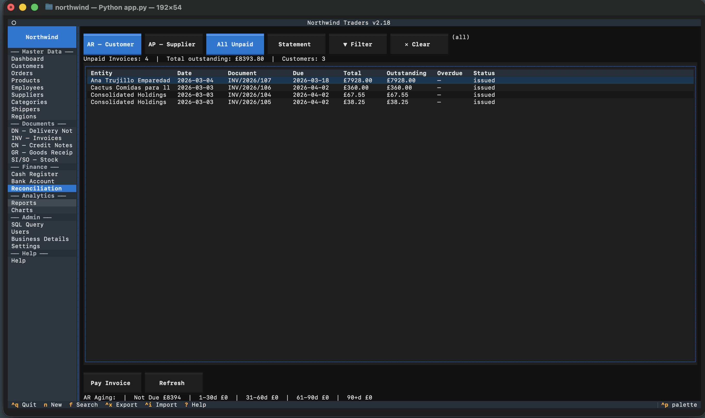
      </a><br/>
      <sub><b>Reconciliation — All Unpaid view</b></sub>
    </td>
    <td align="center">
      <a href="screenshots/reconciliation-customer-statement.png">
        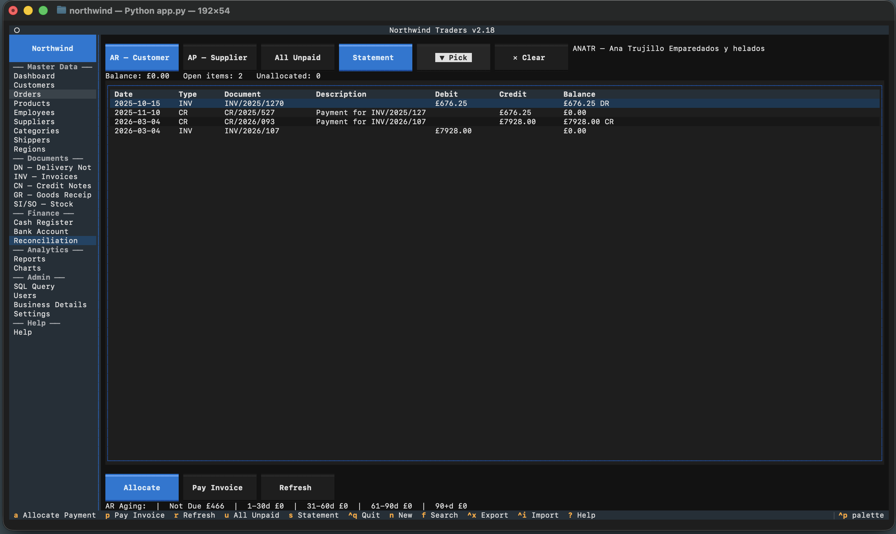
      </a><br/>
      <sub><b>Customer statement view</b></sub>
    </td>
  </tr>
</table>

---

### Admin & Settings

Business Details stores company identity (name, address, VAT, bank account, logo) used on all PDFs — changes take effect immediately on next export. The Settings panel configures currency, theme (Ctrl+P palette), stock-control rules, Demo/Production mode, and the new Backup & Restore controls. User Management handles account creation, PIN resets, and role assignment. The SQL Query editor accepts any read/write SQLite statement and renders results in a live DataTable. All admin panels are hidden from non-admin users.

<table>
  <tr>
    <td align="center">
      <a href="screenshots/business-details-set.png">
        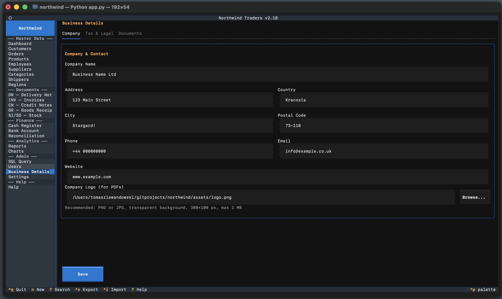
      </a><br/>
      <sub><b>Business Details — company identity</b></sub>
    </td>
    <td align="center">
      <a href="screenshots/settings1.png">
        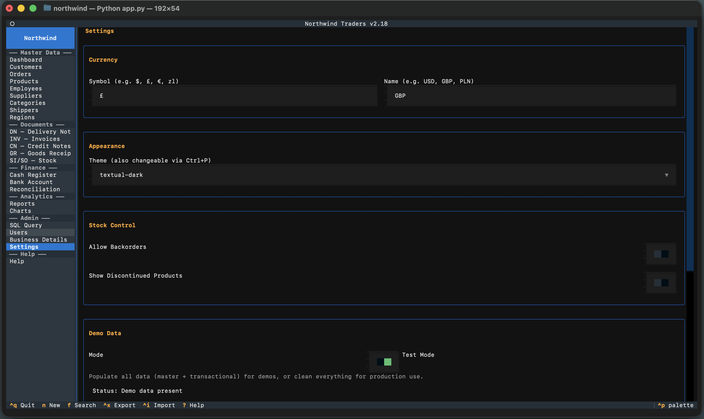
      </a><br/>
      <sub><b>Settings — currency &amp; theme</b></sub>
    </td>
    <td align="center">
      <a href="screenshots/settings2-themes.png">
        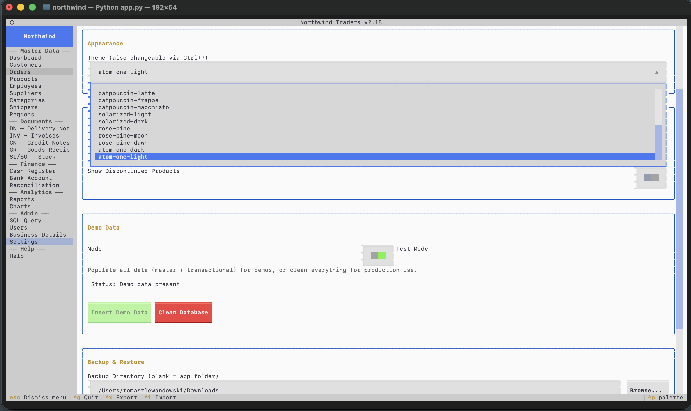
      </a><br/>
      <sub><b>Theme picker (Ctrl+P)</b></sub>
    </td>
    <td align="center">
      <a href="screenshots/backup.png">
        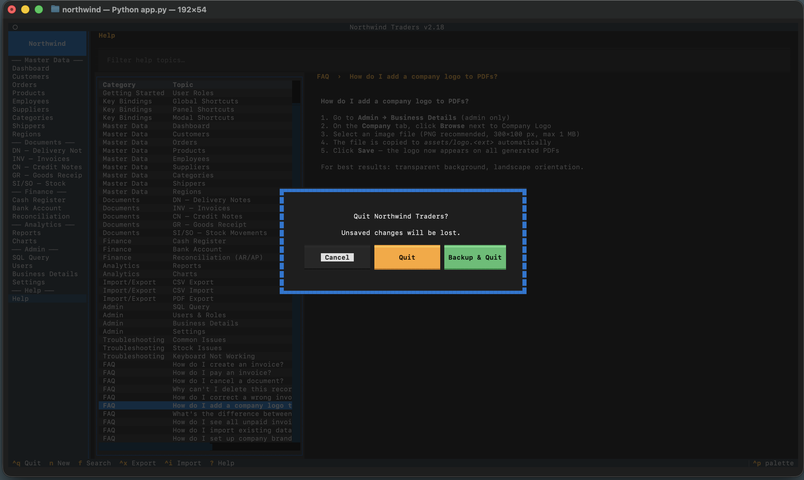
      </a><br/>
      <sub><b>Backup &amp; Restore settings</b></sub>
    </td>
  </tr>
  <tr>
    <td align="center">
      <a href="screenshots/user-mngmt.png">
        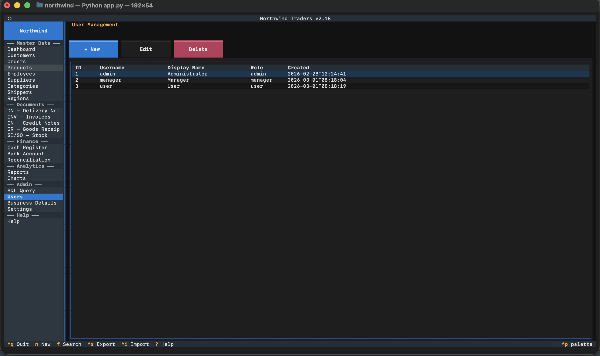
      </a><br/>
      <sub><b>User Management</b></sub>
    </td>
    <td align="center">
      <a href="screenshots/SQL-Query-editor.png">
        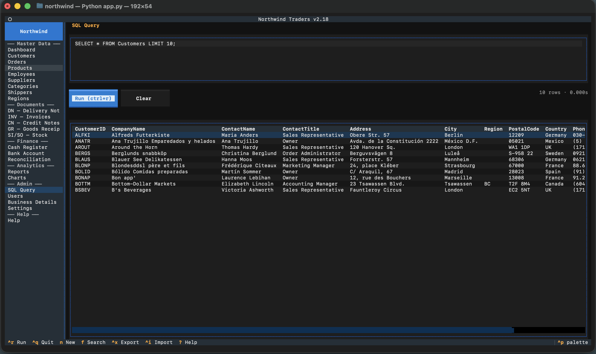
      </a><br/>
      <sub><b>SQL Query editor</b></sub>
    </td>
  </tr>
</table>

---

### Help & Keyboard

The built-in Help panel (`?`) contains a searchable FAQ organised by category. Pressing `?` from any panel pre-filters the help index to the current context (e.g. pressing `?` on the Invoice list jumps to the "invoice" topic). The keyboard cheat-sheet screenshots show the complete shortcut reference available from within the app.

<table>
  <tr>
    <td align="center">
      <a href="screenshots/help.png">
        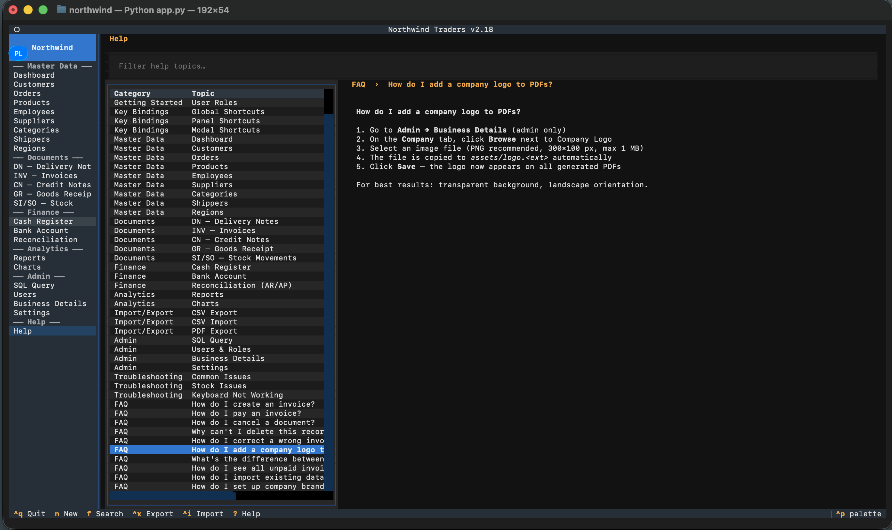
      </a><br/>
      <sub><b>Help panel — context-sensitive search</b></sub>
    </td>
    <td align="center">
      <a href="screenshots/key-cheat-sheet1.png">
        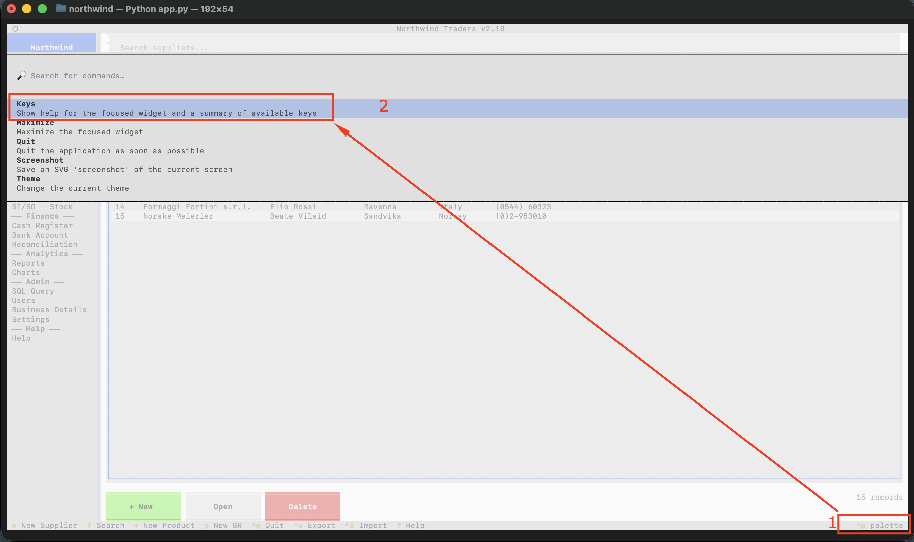
      </a><br/>
      <sub><b>Keyboard cheat sheet (page 1)</b></sub>
    </td>
    <td align="center">
      <a href="screenshots/key-cheat-sheet2.png">
        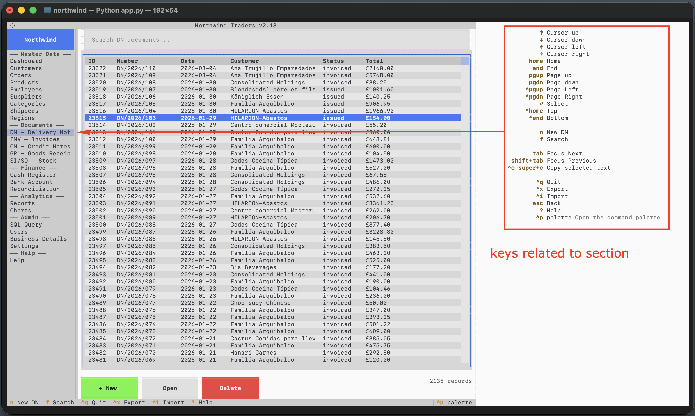
      </a><br/>
      <sub><b>Keyboard cheat sheet (page 2)</b></sub>
    </td>
  </tr>
</table>

---

## Installation

### Quick start

**Linux / macOS**
```bash
git clone git@github.com:AmigoUK/northwind.git
cd northwind
bash install.sh      # one-time: checks Python 3.9+, installs all packages
bash app.sh          # run the app (re-checks deps on every launch)
```

**Windows**
```
git clone git@github.com:AmigoUK/northwind.git
cd northwind
install.bat          ← one-time installer
app.bat              ← run the app (auto-installs if deps are missing)
```

Default login: **username** `admin` / **PIN** `1234`

### Manual installation (all platforms)
```bash
# Requires Python 3.9+
pip install -r requirements.txt
python3 app.py          # Linux / macOS
python  app.py          # Windows
```

### What the scripts do
| Script | Platform | Purpose |
|--------|----------|---------|
| `install.sh` | Linux/macOS | Checks Python ≥ 3.9, runs `pip3 install -r requirements.txt` |
| `app.sh` | Linux/macOS | Checks deps on every launch; calls `install.sh` if any are missing |
| `install.bat` | Windows | Checks Python ≥ 3.9, runs `pip install -r requirements.txt` |
| `app.bat` | Windows | Checks deps on every launch; calls `install.bat` if any are missing |

---

## Dependencies

| Package | Version | Purpose |
|---------|---------|---------|
| `textual` | ≥ 0.80.0 | TUI framework |
| `plotext` | ≥ 5.2 | ASCII charts in terminal (v2.0) |
| `fpdf2` | ≥ 2.7 | PDF generation — branded delivery notes & invoices (v2.1) |
| `Pillow` | ≥ 10.0 | Company logo embedding in PDFs; QR image conversion (v2.1, v2.14) |
| `qrcode` | ≥ 7.4 | QR code generation for all PDF document types (v2.14) |

Install all at once:
```bash
pip install -r requirements.txt
```

---

## Project Structure

```
northwind/
├── app.py              # Textual App entry point, login flow, sidebar nav
├── db.py               # SQLite schema DDL + seed data
├── pdf_export.py       # PDF generation for all document types (v2.1–v2.14)
├── northwind.tcss      # Textual CSS (layout, modals, panels, charts)
├── requirements.txt    # Python dependencies
├── assets/             # Static assets — company logo copied here via Business Details browse
├── CLAUDE.md           # Claude Code context — per-commit checklist, architecture notes
├── data/               # Data-access layer (pure SQL, no UI)
│   ├── settings.py     # AppSettings key-value store (currency, theme, business details)
│   ├── users.py        # AppUsers CRUD + PIN authentication + role hierarchy (v2.4)
│   ├── dashboard.py    # KPI aggregations + kpis_extended()
│   ├── reports.py      # 12 report queries (sales, stock, trend, overdue, supplier spending…)
│   ├── delete_guards.py # Centralized delete guards + side-effect handlers (v2.4)
│   ├── dn.py           # DN (Delivery Note) CRUD + issue + cancel workflow
│   ├── inv.py          # INV (Invoice) CRUD + cancel
│   ├── cn.py           # CN (Credit Note) CRUD + business logic (v2.4)
│   ├── gr.py           # GR (Goods Receipt) CRUD + cancel; cash→bank fallback on receive (v2.17)
│   ├── si_so.py        # SI/SO (Stock Issue / Stock Out) CRUD
│   ├── cash.py         # Cash Register entries (CR/CP); get_cash_balance() + non-negative guards (v2.17)
│   ├── bank.py         # Bank Account entries
│   ├── reconciliation.py # AR/AP reconciliation queries, aging, allocation (v2.13)
│   └── ...             # customers, orders, products, employees, …
├── screens/            # Textual Widget subclasses (one per section)
│   ├── login.py        # LoginScreen modal (PIN gate)
│   ├── dashboard.py    # Dashboard KPI cards + recent orders
│   ├── charts.py       # Charts panel — Sales Trend / Category Mix / Employees / Cash & Bank Account
│   ├── reports.py      # Reports panel with 12 report types + CSV export
│   ├── cn.py           # CN Credit Notes panel + creation wizard + detail modal (v2.4)
│   ├── modals.py       # Shared modals: ConfirmDelete, CleanDatabase, TestModeWarning, FileSelectModal, QuitConfirmModal (v2.8, v2.16, v2.18)
│   ├── export_helpers.py # Centralized CSV export logic + FileSelectModal integration (v2.8)
│   ├── dn.py           # DN Delivery Notes panel + modals + cancel button
│   ├── inv.py          # INV Invoices panel + modals + CN integration
│   ├── gr.py           # GR Goods Receipts panel + modals + cancel button
│   ├── reconciliation.py # AR/AP Reconciliation panel — All Unpaid + Statement sub-views (v2.13)
│   ├── help.py         # Help panel — searchable topics + context-sensitive open_with_context() (v2.15)
│   └── ...             # sql, settings, business, users, cash, bank, …
└── tests/              # Automated test suite — 172 tests across 8 modules
    ├── conftest.py     # Fresh temp DB per test
    ├── test_data.py    # Core business logic (19 tests)
    ├── test_delete_guards.py  # Delete guards + side-effects (26 tests)
    ├── test_cancellation.py   # DN/INV/GR cancellation (13 tests)
    ├── test_cn.py             # Credit Notes — all 3 types (24 tests)
    ├── test_csv_import.py     # CSV import round-trip + alias mapping (28 tests)
    ├── test_demo.py           # Demo data insert / clean / has_demo_data (48 tests)
    └── test_reconciliation.py # AR/AP reconciliation + All Unpaid queries (14 tests)
```

---

## Key Bindings

| Key | Action |
|-----|--------|
| `ctrl+Q` | Quit (shows Cancel / Quit / Backup & Quit dialog) |
| `N` | New record (in active panel) |
| `F` | Focus search box (in active panel) |
| `ctrl+r` | Run SQL query (SQL Query panel) |
| `ctrl+X` | Export current view to CSV |
| `ctrl+I` | Import CSV into current panel |
| `R` | Refresh (Dashboard / Charts / Reports) |
| `U` | Switch to All Unpaid view (Reconciliation panel) |
| `S` | Switch to Statement view (Reconciliation panel) |
| `P` | Pay selected Invoice (Reconciliation panel) |
| `?` | Open Help (context-sensitive — jumps to topic for the active panel) |
| `ESC` | Close modal / go back |

**Quit dialog keys** (shown after `Ctrl+Q`)

| Key | Action |
|-----|--------|
| `Esc` | Cancel — stay in app |
| `Q` | Quit without backup |
| `B` | Backup & Quit |

---

## What I Learned

| Concept | Where it appears |
|---------|-----------------|
| SQLite with `sqlite3` — CRUD, JOINs, aggregations, transactions | `db.py`, `data/*.py` |
| `cursor.description` to read column names dynamically | `screens/sql.py` |
| `INSERT OR REPLACE` as a key-value upsert | `data/settings.py` |
| `hashlib.sha256` for one-way PIN hashing | `data/users.py` |
| Textual `ModalScreen` + `dismiss()` callback pattern | all form modals |
| Role-based UI (same app, different views per role) | `app.py` `_apply_role_visibility()` |
| Textual `ContentSwitcher` for single-page navigation | `app.py` |
| `TextArea` widget for multi-line code input | `screens/sql.py` |
| CSV export with Python's `csv` module + centralized helper pattern | `screens/export_helpers.py` |
| MVC-style layered architecture (`data/` + `screens/`) | whole project |
| CSS `1fr` columns for multi-column form rows | `northwind.tcss`, all form modals |
| `plotext` for ANSI ASCII charts inside Textual `Static` widgets | `screens/charts.py` |
| `TabbedContent` + `TabPane` for multi-view panels | `screens/charts.py`, regions |
| SQL window functions: `strftime`, `julianday`, `AVG` | `data/reports.py`, `data/dashboard.py` |
| Document workflow state machine (draft → issued) | `data/dn.py`, `data/inv.py`, `data/gr.py` |
| Key-value settings store for business/document config | `data/settings.py`, `screens/business.py` |
| `fpdf2` subclassing for custom footers and multi-column layouts | `pdf_export.py` |
| Embedding images and drawing shapes/lines with FPDF primitives | `pdf_export.py` |
| Reusable PDF helpers (`_draw_header`, `_draw_amount_box`, `_draw_signature_line`) shared across document types | `pdf_export.py` |
| Generating voucher-style single-entry PDFs (CR, CP, Bank) vs multi-line table PDFs (DN, INV, GR) | `pdf_export.py` |
| CSS selector specificity in Textual — type+class beats class alone; later rules win on equal specificity | `northwind.tcss` |
| `dock: bottom` to pin a widget (Save button) regardless of sibling content height | `northwind.tcss` |
| `overflow-y: auto` on `TabPane` to make long forms scrollable within a tab | `northwind.tcss` |
| `TabbedContent` inside a panel to split a long settings page into navigable tabs | `screens/business.py` |
| Grouping related fields into 2- and 3-column `form-row` layouts to reduce vertical height | `screens/business.py` |
| Merging redundant sections (Company Identity + Contact Details) into one compact block | `screens/business.py` |
| Balancing widget height (Select `height: 2`) vs readability to keep forms within one screen | `northwind.tcss` |
| Hierarchical RBAC — numeric role levels with `has_permission()` comparator | `data/users.py` |
| Centralized delete guards returning `(bool, list[str])` reason tuples | `data/delete_guards.py` |
| Side-effect handlers that run before DELETE — payment reversal, stock restoration | `data/delete_guards.py` |
| Document cancellation as a state-machine transition with audit fields (CancelledAt/By/Reason) | `data/dn.py`, `data/inv.py`, `data/gr.py` |
| Credit note (CN) pattern — recording original vs corrected values per line item | `data/cn.py` |
| In-place INV.TotalNet adjustment on CN creation + status recalculation | `data/cn.py` |
| Multi-step creation wizard in a single ModalScreen (pick INV → type → items → confirm) | `screens/cn.py` |
| `conn.execute()` vs `conn.executescript()` for reliable schema migration on existing databases | `db.py` |
| pytest fixtures with `tmp_path` for isolated per-test SQLite databases | `tests/conftest.py` |
| Testing cross-document effects: Order → DN → INV → CR → CN → verify all balances | `tests/test_cn.py` |
| Textual `DirectoryTree` subclassing with `filter_paths()` for extension-based file filtering | `screens/modals.py` |
| Stacking `ModalScreen` instances — pushing a file browser from within an import modal | `screens/modals.py` |
| Extracting duplicated logic into a shared helper with callback-based modal integration | `screens/export_helpers.py` |
| Header alias maps with `setdefault` to accept multiple CSV column naming conventions without overriding exact matches | `data/csv_import.py` |
| `qrcode` library — `QRCode(version=None, fit=True)` for auto-sizing; `ERROR_CORRECT_M` for 15 % damage tolerance | `pdf_export.py` |
| `tempfile.NamedTemporaryFile(delete=False)` pattern: close handle inside `with`, then read file, then `os.remove()` — required on Windows | `pdf_export.py` |
| `.convert("RGB")` to strip PNG alpha channel before fpdf2 embedding | `pdf_export.py` |
| Defensive `try/except Exception: pass` wrapper so QR failure never aborts PDF generation | `pdf_export.py` |
| `shutil.copy2()` to copy a user-selected file into the app's `assets/` folder with metadata preserved | `screens/business.py` |
| Python 3.9 compat — `X \| Y` union type syntax requires 3.10+; use `Optional[X]` or omit annotation | `screens/business.py` |
| Textual CSS specificity trap — `.parent Vertical` (0-1-1) beats `.child-class` (0-1-0); fix with 3-part `Widget .section Vertical` rule (0-1-2) | `northwind.tcss` |
| JOIN vs LEFT JOIN in date-filtered reports — LEFT JOIN includes rows outside the date range; JOIN excludes them correctly | `data/reports.py` |
| Scoped KPI query `kpis_for_period(date_from, date_to)` for period-specific charts bar vs global `kpis_extended()` | `data/dashboard.py` |
| Context-sensitive navigation — storing a `{section_id: search_term}` map and calling `open_with_context()` to pre-filter the Help panel from any active panel | `app.py`, `screens/help.py` |
| `Switch.Changed` async timing trap — setting `.value` enqueues the message rather than dispatching it in-place; a `_mode_switching` boolean flag is already `False` before the message fires; robust fix: compare `event.value` against the persisted DB state | `screens/settings.py` |
| Data-layer balance guards — raise `ValueError` before any INSERT so the UI can catch and display the error without the DB ever seeing an invalid state | `data/cash.py` |
| Graceful payment fallback — checking a resource constraint at the call site and re-routing (cash → bank) instead of raising, so automated flows never crash | `data/gr.py`, `data/demo.py` |
| Parameterising `ModalScreen` return type (`ModalScreen[str]` vs `[bool]`) to return a named result string instead of a bare boolean — makes multi-outcome dialogs self-documenting | `screens/modals.py` |
| `shutil.copy2()` for timestamped DB backup — preserves file metadata; wrapping in `try/except OSError` and surfacing via `self.notify()` keeps the TUI from crashing on permission errors | `app.py` |
